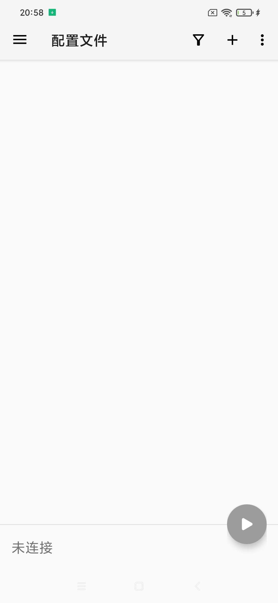
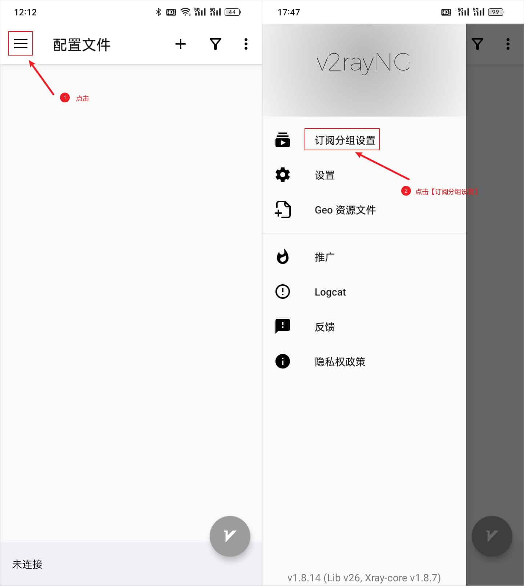
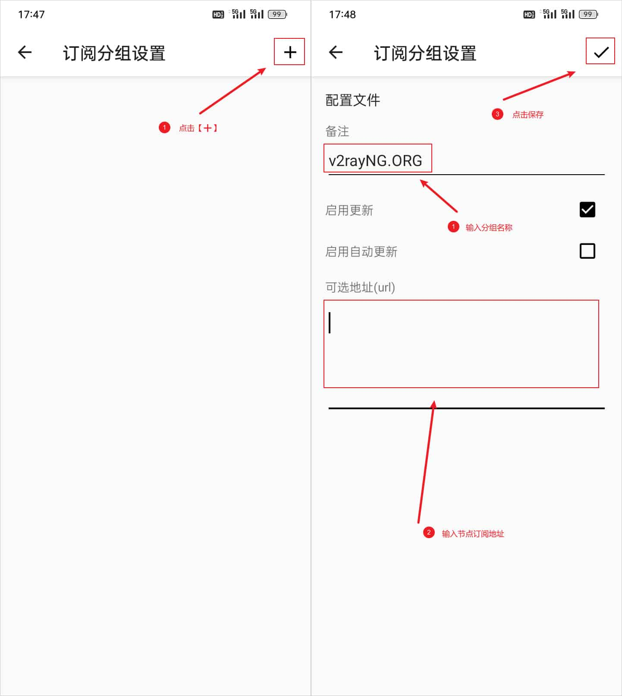
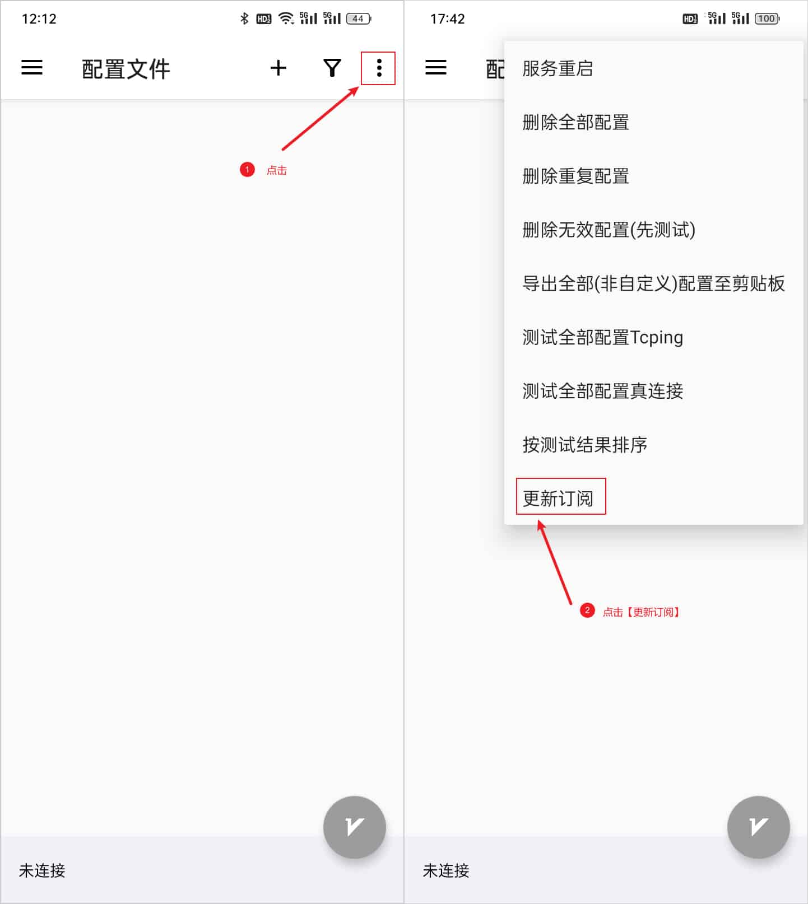
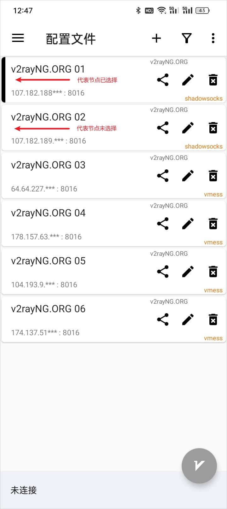
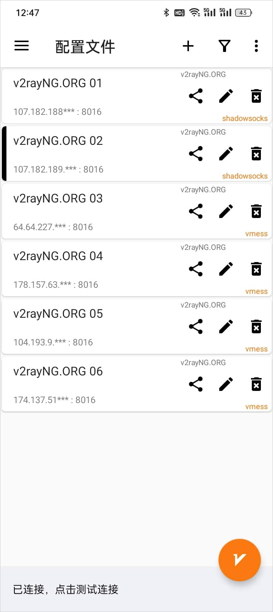

# 🚀 v2rayNG - Complete Android Proxy Solution

> ⚡ **The Most Popular Android Proxy Client** | Open source, powerful, and supports all major protocols

[v2rayNG](https://github.com/2dust/v2rayNG) is the most widely used proxy client for Android, developed by the same team behind v2rayN for Windows. It offers comprehensive protocol support and user-friendly interface, making it the go-to choice for Android users.

## 📊 Protocol Support Matrix

| Protocol | Support Status | Performance | Security | Recommendation |
|----------|----------------|-------------|----------|----------------|
| 🚀 **VMess** | ✅ Native | ⭐⭐⭐⭐⭐ | ⭐⭐⭐⭐⭐ | ⭐⭐⭐⭐⭐ |
| 🔐 **VLESS** | ✅ Native | ⭐⭐⭐⭐⭐ | ⭐⭐⭐⭐⭐ | ⭐⭐⭐⭐⭐ |
| 🔒 **Shadowsocks** | ✅ Native | ⭐⭐⭐⭐ | ⭐⭐⭐⭐ | ⭐⭐⭐⭐ |
| 🧦 **SOCKS** | ✅ Native | ⭐⭐⭐⭐ | ⭐⭐⭐ | ⭐⭐⭐ |
| 🛡️ **Trojan** | ✅ Native | ⭐⭐⭐⭐⭐ | ⭐⭐⭐⭐⭐ | ⭐⭐⭐⭐⭐ |
| 🔗 **WireGuard** | ✅ Native | ⭐⭐⭐⭐⭐ | ⭐⭐⭐⭐⭐ | ⭐⭐⭐⭐ |

## 🔧 System Requirements

### 📱 Android Compatibility

| Requirement | Minimum | Recommended | Notes |
|-------------|---------|-------------|-------|
| **Android Version** | 5.0 (API 21) | 10.0+ | Latest features require newer Android |
| **RAM** | 2GB | 4GB+ | Smooth operation |
| **Storage** | 50MB | 200MB+ | Including cache and logs |
| **CPU** | ARMv7 | ARM64 | Better performance on 64-bit |
| **Network** | 3G/WiFi | 4G/5G/WiFi | Stable connection recommended |

## 📥 Official Downloads

> 💡 **Download Tips**: Always download from official sources to ensure security and authenticity

### 🌟 Primary Download Sources

| Download Source | Type | Speed | Reliability | Recommendation |
|----------------|------|-------|-------------|----------------|
| [🚀 Mirror 1](https://git.886.be/https://github.com/2dust/v2rayNG/releases/download/1.9.33/v2rayNG_1.9.33_universal.apk) | Accelerated | ⭐⭐⭐⭐⭐ | ⭐⭐⭐⭐⭐ | ⭐⭐⭐⭐⭐ |
| [⚡ Mirror 2](https://gh.xxooo.cf/https://github.com/2dust/v2rayNG/releases/download/1.9.33/v2rayNG_1.9.33_universal.apk) | Accelerated | ⭐⭐⭐⭐ | ⭐⭐⭐⭐ | ⭐⭐⭐⭐ |
| [📦 Official GitHub](https://github.com/2dust/v2rayNG/releases/download/1.9.33/v2rayNG_1.9.33_universal.apk) | Official | ⭐⭐⭐ | ⭐⭐⭐⭐⭐ | ⭐⭐⭐⭐⭐ |
| [🔗 Official Site](https://dl.v2rayng.org/releases/latest/v2rayNG_1.8.12.apk) | Official | ⭐⭐⭐ | ⭐⭐⭐⭐⭐ | ⭐⭐⭐⭐ |

### 📋 Version Information

- **Latest Version**: v1.9.33
- **File Size**: ~35MB
- **Architecture**: Universal (ARM + ARM64 + x86)
- **Minimum Android**: 5.0 (API 21)
- **Target Android**: 14 (API 34)

## 🛠️ Installation Guide

### 📱 Installation Methods

#### 🏪 Google Play Store (If Available)
1. Search for "v2rayNG" in Google Play Store
2. Tap "Install" and wait for automatic download
3. App will be installed automatically
4. **Advantage**: Automatic updates, verified by Google

#### 📦 APK Installation (Recommended)
1. **Download APK**: Use one of the links above
2. **Enable Unknown Sources**:
   - Go to Settings → Security → Unknown Sources
   - Enable "Install from Unknown Sources"
3. **Install APK**: Tap the downloaded APK file
4. **Grant Permissions**: Allow installation when prompted

> ⚠️ **Security Note**: Only download APK files from official sources listed above

### 🔐 First Launch Setup

After installation, open v2rayNG to access the main interface:

> **Interface Overview**: The main screen shows your configuration list and connection status

## 🚀 Complete Usage Guide

### 📥 Method 1: Import Subscription

#### Step 1: Copy Subscription Link

> **Get Subscription**: Copy the subscription URL from your service provider

#### Step 2: Import Subscription

> **Access Import**: Tap the "+" button in the top-right corner

> **Choose Method**: Select "Import subscription from clipboard" for automatic import

### ⚙️ Method 2: Manual Server Configuration

#### Step 1: Add Server Manually

Tap "+" → "Manually input VMess/VLESS/etc." to add individual servers

#### Step 2: Configure Server Details

Fill in the following information:
- **Address**: Server IP or domain
- **Port**: Server port number
- **User ID**: Your unique identifier
- **Security**: Encryption method
- **Network**: Transport protocol

### 📱 Method 3: QR Code Scanning

#### Step 1: Access QR Scanner

Tap "+" → "Scan QR code"

#### Step 2: Scan Configuration

Point camera at QR code containing server configuration

## ⚙️ Advanced Configuration

### 🎯 Routing Rules

v2rayNG supports sophisticated routing rules:

#### 🌐 Domain-based Routing
- **Direct**: Bypass proxy for domestic sites
- **Proxy**: Route through proxy for blocked sites
- **Block**: Block ads and malicious domains

#### 🗺️ Geographic Routing
- **GeoIP CN**: Chinese IP addresses → Direct
- **GeoIP Others**: Foreign IP addresses → Proxy
- **Custom Rules**: User-defined routing logic

### 📊 Performance Optimization

#### 🚀 Speed Enhancement
- **Connection Pool**: Reduce connection overhead
- **Multiplexing**: Multiple streams over single connection
- **Congestion Control**: Optimize for mobile networks

#### 🔋 Battery Optimization
- **Background Limits**: Minimize background activity
- **Sleep Mode**: Pause unnecessary operations
- **Efficient Protocols**: Use battery-friendly protocols

## 🛡️ Security Features

### 🔐 Encryption Standards
- **AES-256-GCM**: Military-grade encryption
- **ChaCha20-Poly1305**: Modern, efficient encryption
- **TLS 1.3**: Latest transport security

### 🛡️ Privacy Protection
- **DNS Security**: Encrypted DNS queries
- **Traffic Obfuscation**: Hide proxy traffic patterns
- **No Logging**: No connection logs stored locally

### 🔒 Certificate Validation
- **Certificate Pinning**: Prevent man-in-the-middle attacks
- **Domain Verification**: Ensure connection authenticity
- **SNI Masking**: Hide destination information

## ❓ Troubleshooting Guide

### 🔧 Connection Issues

**Q: Cannot connect to server?**

A: Check the following:

1. **Network Connection**: Ensure device has internet access
2. **Server Status**: Verify server is online and accessible
3. **Configuration**: Double-check all server parameters
4. **Firewall**: Ensure app isn't blocked by firewall

**Q: Slow connection speed?**

A: Optimization steps:

1. **Server Selection**: Choose server closer to your location
2. **Protocol Change**: Try different protocols (VMess → VLESS)
3. **MTU Settings**: Adjust MTU size for your network
4. **Background Apps**: Close unnecessary apps

### 📱 App-Specific Issues

**Q: App crashes on startup?**

A: Troubleshooting steps:

1. **Clear Cache**: Settings → Apps → v2rayNG → Clear Cache
2. **Reinstall**: Uninstall and reinstall the app
3. **Android Version**: Check compatibility with your Android version
4. **Free Space**: Ensure sufficient storage space

**Q: Battery drain issues?**

A: Power optimization:

1. **Battery Optimization**: Disable battery optimization for v2rayNG
2. **Background Limits**: Adjust background app refresh settings
3. **Protocol Choice**: Use more efficient protocols
4. **Update App**: Keep app updated for efficiency improvements

## 🎨 User Interface Guide

### 🏠 Main Interface Elements

#### 📊 Status Bar
- **Connection Status**: Shows current connection state
- **Speed Indicator**: Real-time upload/download speeds
- **Server Info**: Currently selected server details

#### 📋 Server List
- **Server Cards**: Visual representation of each server
- **Latency Display**: Ping time to each server
- **Selection**: Tap to select active server

#### ⚙️ Settings Access
- **Three-dot Menu**: Access to advanced settings
- **Quick Actions**: Common operations like test speed
- **Profile Management**: Import/export configurations

### 🎛️ Settings Overview

#### 🌐 Network Settings
- **Routing Mode**: Global proxy, PAC mode, or direct
- **DNS Settings**: Custom DNS servers and DoH
- **IPv6 Support**: Enable/disable IPv6 routing

#### 📱 App Settings
- **Start on Boot**: Auto-start with device
- **Background Mode**: Keep alive in background
- **Theme Options**: Light/dark theme selection

## 🔄 Maintenance & Updates

### 📅 Regular Maintenance

#### 🔄 Subscription Updates
- **Auto-Update**: Enable automatic subscription refresh
- **Manual Update**: Refresh when servers change
- **Update Frequency**: Recommended daily or weekly

#### 🧹 Cache Management
- **Clear Logs**: Regular log cleanup for privacy
- **Cache Cleanup**: Remove temporary files
- **Database Optimization**: Maintain app performance

### 🆙 App Updates

#### 🔔 Update Notifications
- **GitHub Releases**: Follow repository for updates
- **In-app Notifications**: Enable update alerts
- **Changelog Review**: Read changes before updating

#### 📦 Update Methods
- **APK Update**: Download and install new APK
- **Play Store**: Automatic updates if available
- **Backup First**: Export configurations before updating

## 📊 Performance Comparison

| Feature | v2rayNG | Other Clients | Advantage |
|---------|---------|---------------|-----------|
| **Protocol Support** | ⭐⭐⭐⭐⭐ | ⭐⭐⭐ | Most comprehensive |
| **User Interface** | ⭐⭐⭐⭐ | ⭐⭐⭐⭐ | Clean and intuitive |
| **Performance** | ⭐⭐⭐⭐⭐ | ⭐⭐⭐⭐ | Optimized core |
| **Stability** | ⭐⭐⭐⭐⭐ | ⭐⭐⭐⭐ | Battle-tested |
| **Open Source** | ✅ | ❌ | Transparent & secure |
| **Community** | ⭐⭐⭐⭐⭐ | ⭐⭐⭐ | Active development |

## 📞 Support & Resources

### 🌍 Official Resources
- 🏠 **GitHub Repository**: [v2rayNG Project](https://github.com/2dust/v2rayNG)
- 📋 **Issue Tracker**: [Report Bugs](https://github.com/2dust/v2rayNG/issues)
- 📚 **Documentation**: [Wiki Pages](https://github.com/2dust/v2rayNG/wiki)

### 💬 Community Support
- 📱 **Telegram**: Active user groups and channels
- 💭 **Reddit**: r/v2ray community discussions
- 🔗 **Forums**: Technical discussions and help

### 🎓 Learning Resources
- 📺 **Video Tutorials**: Step-by-step setup guides
- 📝 **Blog Posts**: Configuration examples and tips
- 📖 **Official Docs**: Comprehensive technical documentation

---

> 📅 Last Updated: July 10, 2025 | 🚀 Compatible Version: v2rayNG 1.9.33+

### 2. Update Subscription Nodes

### 3. Connect to a Node

