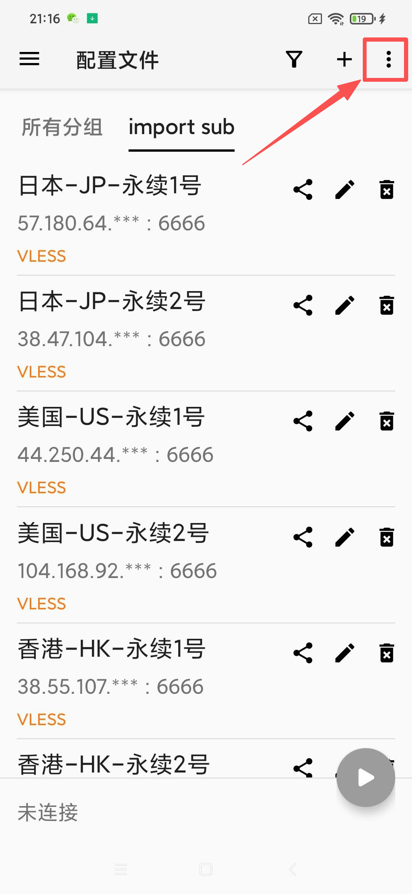

# 📱 v2rayNG - Recommended Android Client

> ⚡ **The Most Popular Android Proxy Client** | Open-source, powerful, and fully supports Xray/VLESS Reality protocols.

**v2rayNG** is the most widely used proxy client for Android, developed by the same team behind v2rayN for Windows. It features comprehensive functionality and a user-friendly interface, making it our top recommendation for Android users.

### 📋 System Requirements

- **OS**: Android 5.0 or higher
- **Devices**: Android Phones / Tablets / E-ink Devices
- **Permissions**: Network access, VPN configuration permission

---

## 📥 Official Safe Free Download

We provide a high-speed, free download channel. The file is hosted on cloud storage and is safe and virus-free.

| Version | Filename | Download Link |
| :--- | :--- | :--- |
| **Latest** | `v2rayNG.apk` | [**⬇️ Click to Download**](https://download.onsucloud.com/v2rayNG.apk) |

> ⚠️ **Important Note for Self-Downloading**
> 
> If you choose to find the installation package yourself, please ensure you use **official channels** (such as GitHub or Google Play). Do not download modified versions from unknown sources to avoid malware.
> 
> **Special Attention**: Please ensure you download the **latest version**! Due to our support for the new Xray/Reality protocols, **older versions of the client may not connect**.

---

## 🛠️ Installation Steps

1. **Download File**: Click the link above to download the `.apk` installation package.
2. **Allow Permissions**: If the system prompts "Install unknown apps blocked," please go to `Settings` → `Security` and enable it, or click `Allow` in the pop-up window.
3. **Complete Installation**: Click the installation package to finish installing, then open the App.

---

## 🚀 User Tutorial

### 1️⃣ Step 1: Import Subscription

**Method A: Scan QR Code (Recommended)**
#### 1. Open v2rayNG, click the `☰` menu icon in the top left (or the `+` sign in the top right).

#### 2. Select **Scan QR Code** (or QRCode).

#### 3. Log in to your account via a browser, find your subscription information, and use your phone to **scan the QR code**.
   

**Method B: Import via Clipboard**
#### 1. **Copy the subscription link** from the user center.

#### 2. Open v2rayNG, click the `☰` menu icon in the top left (or the `+` sign in the top right).

#### 3. Select **"Import config from Clipboard"**.

### 2️⃣ Step 2: Update Subscription (Important)
#### 1. After importing, return to the app's main page and select the **import sub** group (or the name of your subscription). You should now see all available nodes.

#### 2. It is recommended to manually update once to get the latest node list.
- Click the **three-dot menu** `⋮` icon in the top right corner.

- Select **"Update subscription"**.

### 3️⃣ Step 3: Connect

#### 1. **Select a Node**: Click on any node in the list (a green bar will appear on the left when selected).
#### 2. **Start Connection**: Click the **V** logo (looks like a play button) in the bottom right corner.

#### 3. **Authorize VPN**: For the first connection, a system network request will pop up. Please click **"OK"** or **"Allow"**.

> ✅ **Connection Success Indicators**:
> * The bottom bar shows "Connected".

> * A `VPN` or key icon appears in the status bar at the top of your phone.
> * You can access Google/YouTube via your browser.

---

## ❓ FAQ

### 🔧 Connection Issues

**Q: Cannot connect to the server?**

A: Please check:

- Is your internet connection normal?
- Is the subscription link valid?
- Is the server node online?
- Did you allow VPN permissions?

**Q: The speed is very slow?**

A: Suggestions:

- Switch to a different node.
- Check your local network quality (Wi-Fi/Data).
- Choose a server with lower latency.

### 📱 App Issues

**Q: The app cannot be installed?**

A: Please confirm:

- Android version compatibility (5.0+).
- Have you allowed "Install from unknown sources"?
- Is there enough storage space?

---
## 🎫 Need More Help?

If you encounter any issues during use, or if the FAQ above does not resolve your situation, please feel free to contact us:

Please log in to the website backend, go to **"User & Support"** → **"Ticket Management"** to submit a ticket.

> 💡 **We are here to serve you**
> 
> Upon receiving your ticket, our technical support team will investigate and resolve it as soon as possible. To improve efficiency, we recommend attaching **screenshots of errors** or a **detailed description** in your ticket.