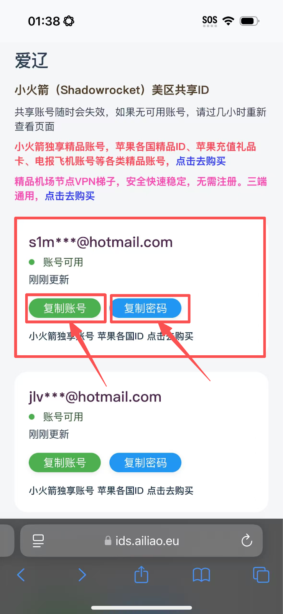
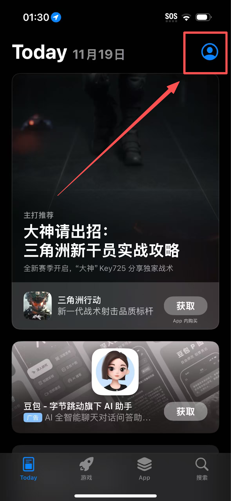
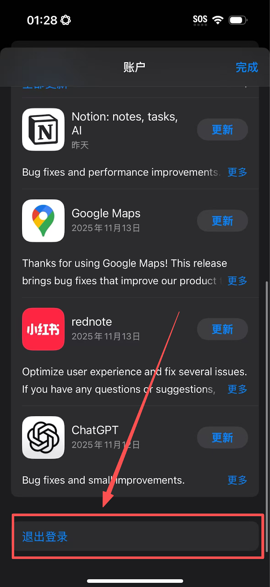
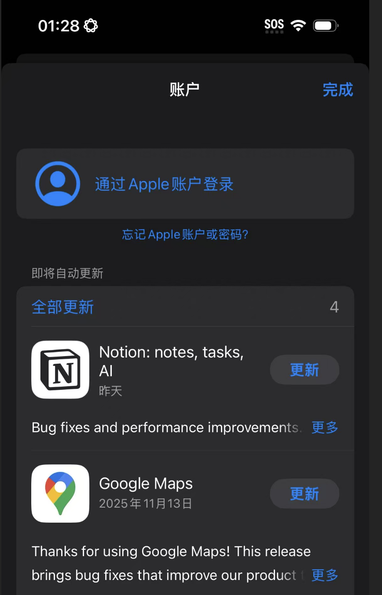
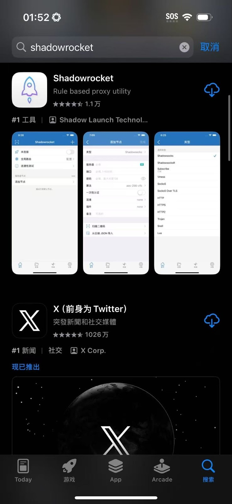
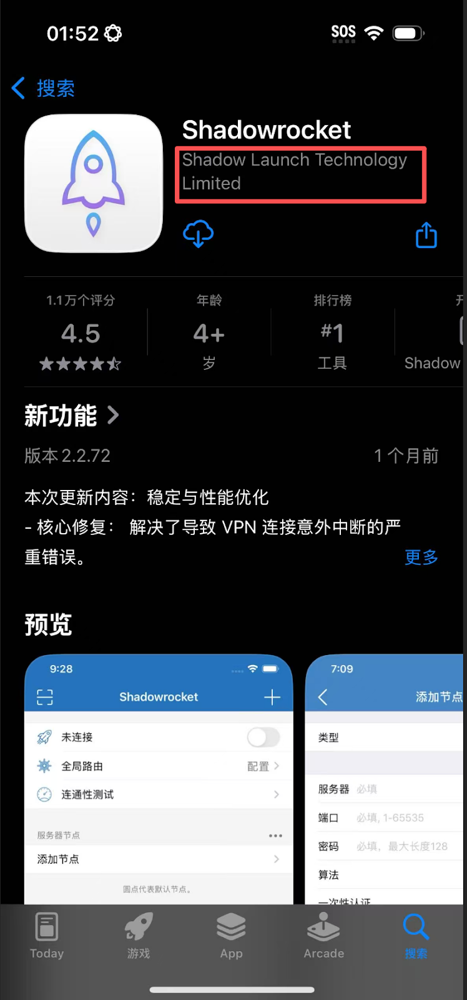

# 🚀 Shadowrocket - Recommended iOS Client

> 🎯 **Shadowrocket** is the most popular lightweight proxy utility on the iOS platform. It is loved by users for its simple interface, stable performance, and affordable price.

### 📱 System Requirements

- **Minimum**: iOS 9.0 or higher
- **Recommended**: iOS 12.0 or higher
- **Devices**: iPhone / iPad / iPod Touch
- **Storage**: ~50MB available space

---

## 📥 Download & Installation

### 🏪 Official Channel (The Only Way)

> ⚠️ **Important Notice**
>
> - **Cannot be downloaded** from the App Store in Mainland China.
> - Requires a **Non-Mainland China Apple ID** (e.g., US, Hong Kong).
> - Recommended regions: US or Hong Kong.

---

### 🔑 Get an Apple ID
#### Method 1: Get a Free Account with Shadowrocket (Recommended)

##### 1. Visit the **[Free Shadowrocket Account Community](https://ids.ailiao.eu/)**
##### 2. Find a recently updated account and click **Copy Account** and **Copy Password**.

> 💡 **Payment Note**:
> Method 2 and Method 3 below are for users who wish to own a **private, permanent account**.
> These methods require you to register an overseas ID yourself and purchase Shadowrocket (Price: **$2.99 USD**).

#### Method 2: Self-Registration

1. Visit [appleid.apple.com](https://appleid.apple.com)
2. Select a region other than Mainland China (e.g., United States).
3. Complete email verification and information filling.

#### Method 3: Purchase an Account

- Choose a reputable vendor.
- Pay attention to account security and after-sales service.
- It is recommended to change the password immediately after purchase.

---
### 🔑 Switch Apple ID

> 💡 **Tip**: If you are already using a Non-Mainland China Apple ID, please ignore this step and download directly from the App Store. Only Mainland China Apple ID users need to switch accounts.

#### 1. Open the **App Store**.

#### 2. Tap the **Avatar / Profile Icon** in the top right corner.

#### 3. **Scroll down to the very bottom** of the page.

#### 4. Tap **Sign Out**.

#### 5. After the page refreshes and returns to the top, enter the **Overseas Apple ID and Password** you just obtained, then tap Sign In.

> ⚠️ **High-Risk Warning: If you are using a shared ID (Method 1), NEVER log in via Settings!**
> * **ABSOLUTELY DO NOT** log in to this shared account in your phone's system 「Settings」 or 「iCloud」. Doing so may cause your phone to be locked!
> * **ONLY** log in within the **App Store** app.

#### 6. **‼️ Critical Step**: If a security prompt appears during login, you must select **"Other Options"** -> **"Don't Upgrade"**.
*(Note: Selecting the wrong option may enable Two-Factor Authentication, preventing future logins)*

#### 7. After logging in successfully, search for `Shadowrocket`.
* Please ensure the developer is **Shadow Launch Technology Limited**.
* Tap the download icon (if using a paid shared account, seeing a cloud icon is normal; you do not need to pay again).

#### 8. **‼️ Critical Step**: After the download is complete, please **Sign Out immediately** and switch back to your own Apple ID.
---

## 🚀 Configuration Tutorial
Before starting, please ensure:

- ✅ Shadowrocket has been successfully installed.

### 🛠️ Import Configuration

#### 🔗 Method 1: Import via Subscription Link

##### Step 1: Open the App

Launch Shadowrocket to enter the main interface:

##### Step 2: Add Subscription

Tap the `+` icon in the top right corner and select `Subscribe`:

##### Step 3: Paste Link

Paste your subscription link into the **URL** field and tap Done/Save:

##### Step 4: Update Subscription

Swipe the subscription item or tap to enter, then find and tap `Update` (or pull down to refresh) to load the nodes:

#### 📱 Method 2: QR Code Scan

##### 1. Tap the **Scan icon** `[-]` in the top left corner.

##### 2. Scan the QR code provided in your user center/subscription page.

##### 3. The configuration will be recognized and imported automatically.

---

## 🌐 Usage Guide

### 🎯 Connect to Server

1. **Select Node**: Tap on a server node in the list to select it (a dot will appear next to it).
2. **Start Connection**: Toggle the switch at the top to enable the proxy.
3. **Confirm Permissions**: First-time users must allow the system to add VPN configurations (Touch ID/Face ID required).
4. **Verify Connection**: Check for the VPN icon in your status bar.

---

## ❓ FAQ

### 🔧 Connection Issues

**Q: What if the connection fails?**

A: Troubleshooting steps:

- Confirm server information is correct.
- Check if your internet connection is working.
- Try switching to a different node.
- Restart the app or your device.

**Q: The speed is slow or unstable?**

A: Optimization tips:

- Choose a node with lower latency (ms).
- Avoid using during peak network hours.
- Check your local network quality.
- Contact customer support.

### 📱 App Issues

**Q: App crashes or freezes?**

A: Solutions:

- Restart the app.
- Restart your iPhone/iPad.
- Check if your iOS version is compatible.
- Clear device storage space.

**Q: Cannot download the app?**

A: Checklist:

- Ensure you are logged into a Non-Mainland China Apple ID.
- Check if the account password is correct.
- Try switching to a different region's Apple ID.

---
## 🎫 Need More Help?

If you encounter any issues during use, or if the FAQ above does not resolve your situation, please feel free to contact us:

Please log in to the website backend, go to **"User Support"** → **"Ticket Management"** to submit a ticket.

> 💡 **We are here to serve you**
> 
> Upon receiving your ticket, our technical support team will investigate and resolve it as soon as possible. To improve efficiency, we recommend attaching **screenshots of errors** or a **detailed description** in your ticket.