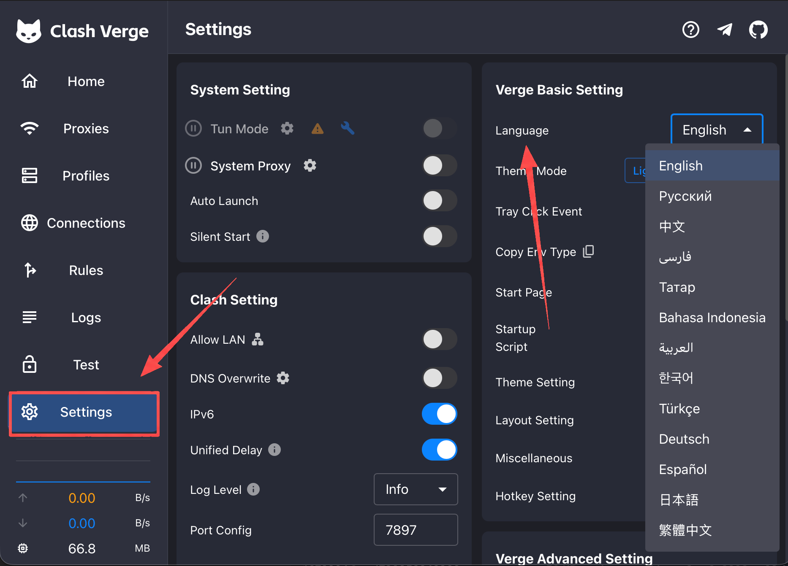
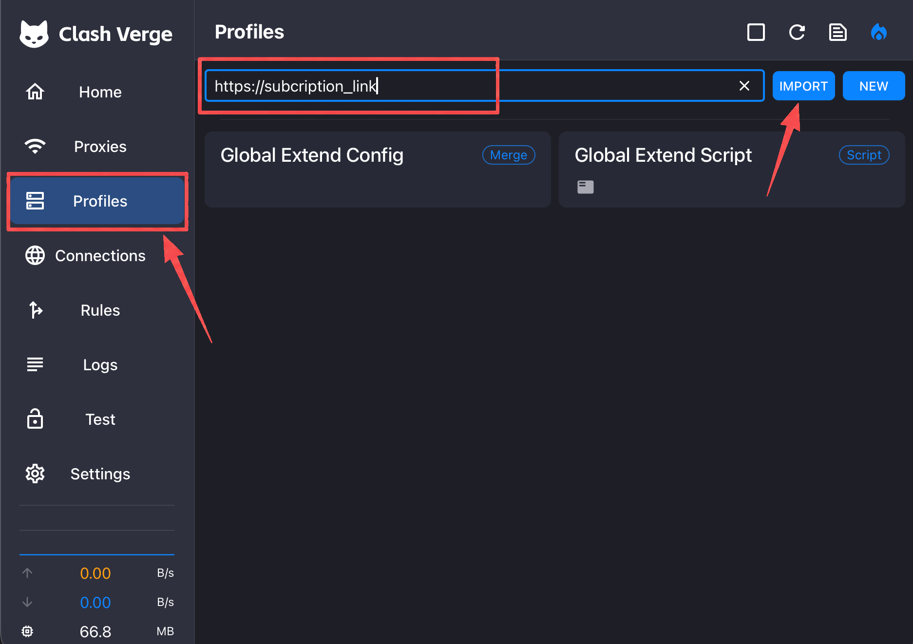
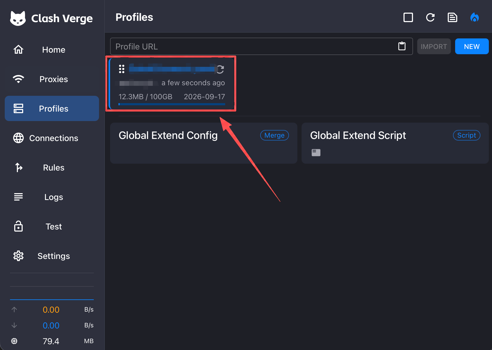
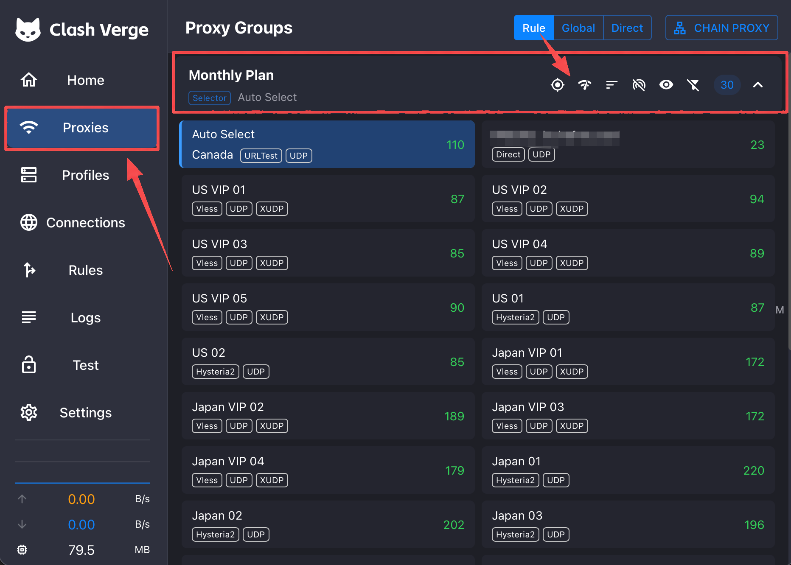
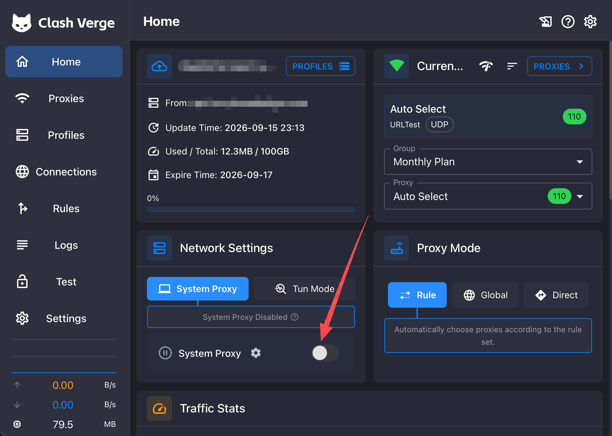

# Clash Verge (Windows)

This guide covers the simplest way to get Clash Verge Rev working. Its Windows and macOS interfaces are nearly identical.

## Step 0: Download and Install

Choose a download source based on your network:

| Download source | Compatible devices | Link |
| :--- | :--- | :--- |
| Fast mirror (Mainland China, recommended) | Most Intel/AMD PCs | [Download Clash Verge v2.5.2](https://dl.onsucloud.com/https://github.com/clash-verge-rev/clash-verge-rev/releases/download/v2.5.2/Clash.Verge_2.5.2_x64-setup.exe) |
| Official source | x64 or ARM64 devices | [Open the official GitHub releases page](https://github.com/clash-verge-rev/clash-verge-rev/releases/latest) |

> The mirror provides the `x64-setup.exe` build used by most Windows PCs. Windows on ARM users should download the `arm64-setup.exe` build from the official source.

| Windows device | File to choose |
| :--- | :--- |
| Most Intel/AMD PCs | A filename containing `x64-setup.exe` |
| Windows on ARM device | A filename containing `arm64-setup.exe` |

Recent Clash Verge Rev versions no longer support Windows 7. Use Windows 10 or Windows 11. Run the downloaded installer and follow the setup prompts.

If Windows SmartScreen appears after downloading from the official releases page, click **More info > Run anyway**. If the app opens to a blank screen or does not display correctly, return to the official releases page and download the installer whose filename contains `fixed_webview2`.

## Step 1: Select English

Open Clash Verge, go to **Settings**, and set **Language** to **English**. If the interface does not update immediately, quit and reopen the app.

## Step 2: Copy and Import Your Subscription

Open your customer dashboard and copy the complete **subscription URL**. Treat this URL like an account credential: do not share it with anyone or post it publicly.

In Clash Verge:

1. Click **Profiles** in the left sidebar.
2. Paste the subscription URL into the field at the top.
3. Click **IMPORT**.

> Do not click **NEW** to create a configuration manually. Most users only need to paste the subscription URL and click **IMPORT**.

## Step 3: Confirm and Refresh the Profile

After a successful import, a profile card appears. It normally shows usage, expiration, and update information. If you have several profiles, click the one you want to use.

Click the **circular arrow** in the upper-right corner of the profile card to refresh it manually. Refresh once after importing. If servers later disappear, stop connecting, or become unusually slow, refresh the profile first.

## Step 4: Test and Select a Proxy

1. Click **Proxies** in the left sidebar.
2. In the proxy group you want to use, click the **Wi-Fi-shaped button** near the top to run a latency test.
3. Wait for the test to finish, then click an available proxy.

Latency is shown in milliseconds (ms). A lower number usually means a faster response, although actual speed also depends on server load and network conditions. If you are unsure what to choose, start with **Auto Select** or a proxy with low latency.

## Step 5: Enable System Proxy

1. Click **Home** in the left sidebar.
2. Keep the proxy mode set to **Rule** (recommended).
3. Turn on **System Proxy**.
4. If Windows requests firewall or administrator permission, follow the system prompt and allow it.

Once enabled, open a website that requires the proxy. If it does not load, return to **Proxies**, select another server, and refresh the page.

### Which proxy mode should I use?

- **Rule**: Routes traffic according to the rules in your profile. Recommended for everyday use.
- **Global**: Sends most traffic through the proxy. Use it only for temporary troubleshooting.
- **Direct**: Bypasses proxy servers. Traffic will not use your selected proxy in this mode.

## How to Turn It Off

Return to **Home** and turn off **System Proxy**. Turn off the switch before quitting Clash Verge so Windows does not retain an unavailable proxy configuration.

## Signs That It Is Working

- The profile card appears under **Profiles** and refreshes without an error.
- Servers appear under **Proxies**, and the latency test returns numbers.
- A proxy is selected and **System Proxy** is enabled.
- Your browser can open the target website.

## Common Problems

- **No servers after importing**: Click the circular refresh arrow on the profile card. If it remains empty, copy the complete subscription URL again and re-import it.
- **Servers appear, but websites do not load**: Make sure **System Proxy** is enabled, then select another server that passed the latency test.
- **Every server times out**: Refresh the profile, verify your normal internet connection, and check whether the subscription has expired.
- **Only some apps bypass the proxy**: Some apps do not follow the system proxy. Beginners should not enable the virtual network adapter/TUN mode at random; confirm the basic steps first, then contact support if needed.
- **Another proxy app is running**: Multiple apps can overwrite the same system proxy settings. Quit other proxy apps before using Clash Verge.

## Still Not Working?

Sign in to the website dashboard and open **User Support > Ticket Management** to submit a ticket.

Include:

- Screenshots of the **Profiles** and **Proxies** pages (hide your subscription URL)
- The currently selected proxy
- The error message and the step where you got stuck
