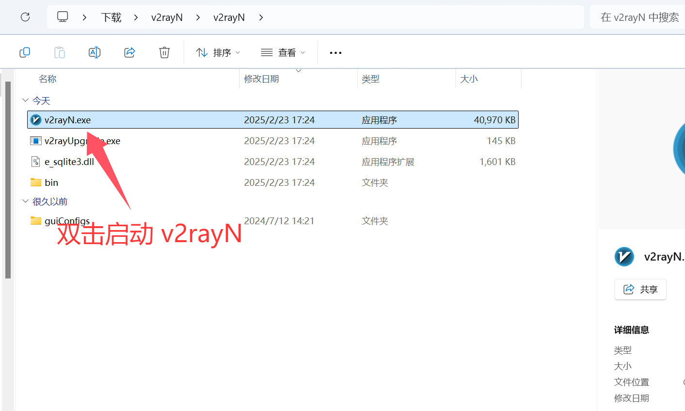
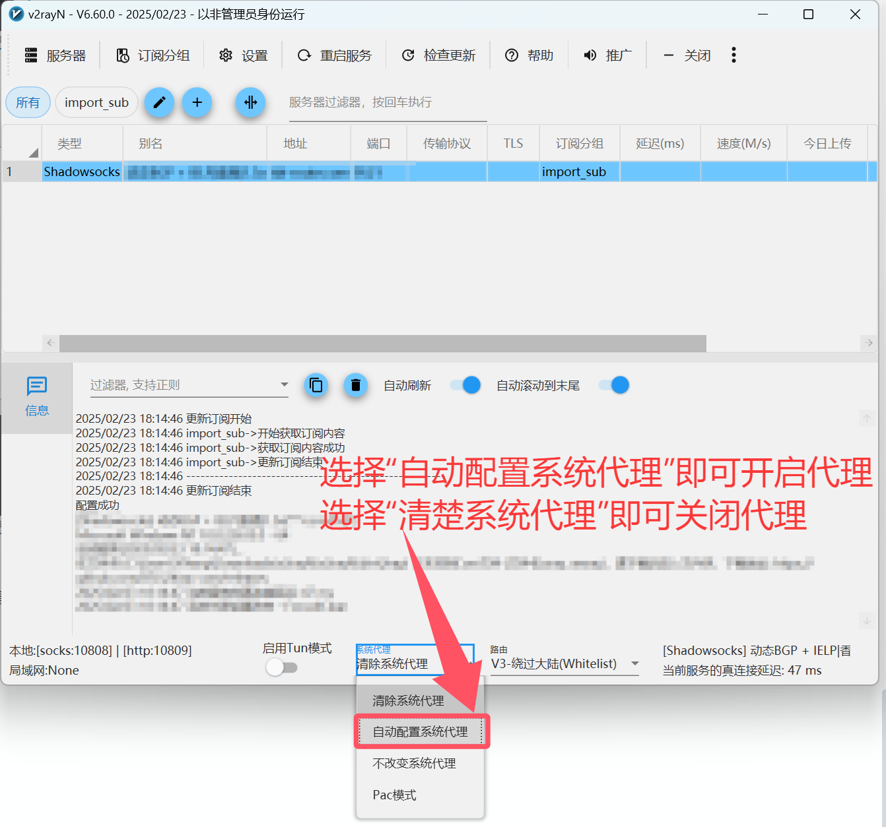
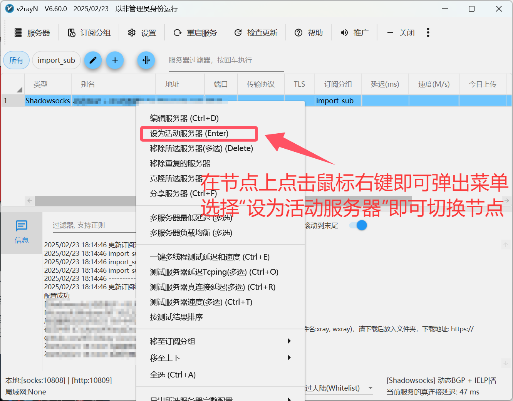
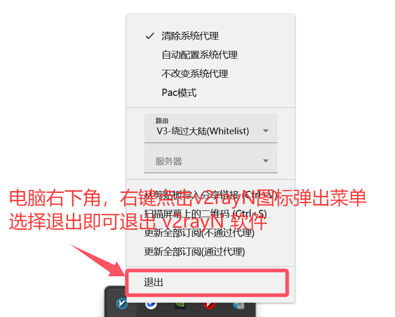

# 🚀 v2rayN for Windows

> ⚡ **Windows Platform's Preferred Proxy Client** | Multi-protocol support, comprehensive features, easy operation

[v2rayN](https://github.com/2dust/v2rayN) is the most popular graphical proxy client for Windows systems, developed based on the .NET framework, supporting numerous mainstream proxy protocols and providing stable and efficient proxy services.

## 📊 Protocol Support

| Protocol Type | Support Status | Performance | Rating |
|--------------|----------------|-------------|---------|
| 🔗 **Shadowsocks (SS)** | ✅ Full Support | ⭐⭐⭐⭐ | ⭐⭐⭐⭐ |
| 🛡️ **ShadowsocksR (SSR)** | ✅ Full Support | ⭐⭐⭐⭐ | ⭐⭐⭐ |
| 🌐 **SOCKS5** | ✅ Full Support | ⭐⭐⭐⭐ | ⭐⭐⭐⭐ |
| ⚡ **Snell** | ✅ Full Support | ⭐⭐⭐⭐⭐ | ⭐⭐⭐⭐ |
| 🚀 **V2Ray (VMess)** | ✅ Full Support | ⭐⭐⭐⭐⭐ | ⭐⭐⭐⭐⭐ |
| 🛡️ **Trojan** | ✅ Full Support | ⭐⭐⭐⭐⭐ | ⭐⭐⭐⭐⭐ |
| 🔐 **VLESS** | ✅ Full Support | ⭐⭐⭐⭐⭐ | ⭐⭐⭐⭐ |
| 🌊 **Hysteria** | ✅ Full Support | ⭐⭐⭐⭐⭐ | ⭐⭐⭐⭐ |

## 🔧 System Requirements

### 💻 Runtime Environment

| Item | Minimum Requirement | Recommended | Description |
|------|-------------------|-------------|-------------|
| **Operating System** | Windows 10 (64-bit) | Windows 10/11 Latest | 64-bit systems only |
| **Processor** | Intel/AMD Dual-core | Quad-core and above | Supports mainstream CPU architectures |
| **Memory** | 4GB RAM | 8GB+ RAM | Ensures smooth operation |
| **Storage** | 100MB+ | 500MB+ | Including config and log files |
| **.NET Framework** | .NET 6.0+ | Latest version | Required runtime environment |

## 📥 Official Downloads

> 💡 **Download Recommendation**: Download latest version from official GitHub or mirror sources

### 🌟 Download Source List

| Download Source | Type | Speed | Stability | Rating |
|----------------|------|-------|-----------|---------|
| [🚀 Mirror Acceleration 1](https://git.886.be/https://github.com/2dust/v2rayN/releases/download/6.60/v2rayN.zip) | Mirror Source | ⭐⭐⭐⭐⭐ | ⭐⭐⭐⭐⭐ | ⭐⭐⭐⭐⭐ |
| [⚡ Mirror Acceleration 2](https://gh.xxooo.cf/https://github.com/2dust/v2rayN/releases/download/6.60/v2rayN.zip) | Mirror Source | ⭐⭐⭐⭐ | ⭐⭐⭐⭐ | ⭐⭐⭐⭐ |
| [📦 Official GitHub](https://github.com/2dust/v2rayN/releases/download/6.60/v2rayN.zip) | Official Source | ⭐⭐⭐ | ⭐⭐⭐⭐⭐ | ⭐⭐⭐⭐⭐ |

### 📋 Version Information

- **Current Version**: v6.60
- **Release Date**: November 2024
- **File Size**: ~15MB
- **File Format**: ZIP archive

## 🚀 Complete Usage Tutorial

### 📥 Step 1: Download and Extract

1. **Download the software**
   - Choose any download link above
   - Download the `v2rayN.zip` file

2. **Extract files**
   - Extract to your preferred directory
   - Ensure path contains no Chinese characters

### 🚀 Step 2: Launch Application

> **First Launch**: Double-click `v2rayN.exe` to start the application

### 📋 Step 3: Copy Subscription

> **Get Subscription**: Copy your subscription link from service provider

### 📥 Step 4: Import Subscription

> **Add Subscription**: Paste subscription link in the import dialog

### 🔄 Step 5: Update Nodes

> **Update Subscription**: Refresh to get latest node information

### ⚡ Step 6: Enable Proxy

> **System Proxy**: Enable system-wide proxy settings

### 🔄 Step 7: Switch Nodes

> **Node Selection**: Choose optimal server for your needs

### 🔴 Step 8: Disable Proxy

> **Stop Service**: Disable proxy when not needed

## 🎛️ Advanced Features

### 🎯 Smart Routing

- **PAC Mode**: Automatic proxy for blocked sites only
- **Global Mode**: Route all traffic through proxy
- **Direct Mode**: Bypass proxy for all traffic

### 📊 Performance Monitoring

- **Real-time Statistics**: Monitor upload/download speeds
- **Connection Logs**: Detailed connection information
- **Latency Testing**: Test server response times
- **Traffic Analysis**: Analyze data usage patterns

### 🔧 Configuration Management

- **Multiple Profiles**: Support for multiple configuration files
- **Auto Updates**: Automatic subscription updates
- **Backup/Restore**: Configuration backup and restoration
- **Custom Rules**: Advanced routing rule customization

## ❓ Frequently Asked Questions

### 🔧 Installation Issues

**Q: Software won't start or shows errors?**

A: Common solutions:

1. Ensure .NET 6.0+ is installed
2. Run as administrator
3. Check Windows Defender/antivirus settings
4. Verify file integrity

**Q: "Access denied" error?**

A: Permission solutions:

1. Extract to a user-writable directory
2. Run as administrator
3. Add exception to antivirus software
4. Check Windows UAC settings

### 🌐 Connection Issues

**Q: Can't connect after configuration?**

A: Troubleshooting steps:

1. ✅ Verify subscription link validity
2. ✅ Check network connectivity
3. ✅ Test different server nodes
4. ✅ Confirm firewall settings

**Q: Slow speeds or frequent disconnections?**

A: Performance optimization:

1. 🔄 Select servers with lower latency
2. 🎯 Switch between different proxy modes
3. 📊 Check local network conditions
4. 🔧 Try different encryption protocols

### ⚙️ Configuration Issues

**Q: How to update subscription?**

A: Update steps:

1. Right-click system tray icon
2. Select "Update subscription"
3. Wait for automatic update completion

**Q: How to backup configuration?**

A: Backup method:

1. Locate configuration files in program directory
2. Copy entire folder to safe location
3. Restore by replacing files when needed

## 🔄 Version History

- **v6.60 (2024.11)**: Performance optimization, new protocol support
- **v6.50 (2024.09)**: Interface improvements, bug fixes
- **v6.40 (2024.07)**: Enhanced stability, new features added

## 💡 Usage Tips

### ⚡ Performance Optimization

1. **Mode Selection**
   - Use PAC mode for daily browsing
   - Global mode for special requirements
   - Direct mode for troubleshooting

2. **Regular Maintenance**
   - Update subscriptions weekly
   - Clear logs periodically
   - Keep software updated

3. **Server Optimization**
   - Choose geographically closer servers
   - Select appropriate protocols for use case
   - Avoid frequent server switching

### 🛡️ Security Recommendations

1. **Service Selection**: Use trusted proxy service providers
2. **Configuration Security**: Regularly change passwords and configurations
3. **Network Security**: Avoid using on public networks

## 📚 Related Resources

### 📖 Official Documentation

- [v2rayN Official Repository](https://github.com/2dust/v2rayN)
- [V2Ray Core Documentation](https://www.v2ray.com/)
- [Protocol Configuration Examples](https://github.com/2dust/v2rayN/wiki)

### 🛠️ Useful Tools

- **Configuration Converters**: [Online converter tools](https://acl4ssr.netlify.app/)
- **Rule Subscriptions**: [ACL4SSR Rules](https://github.com/ACL4SSR/ACL4SSR)
- **Server Testing**: Built-in latency testing feature

## 🎯 Summary and Evaluation

### ✅ Advantages

- 🖥️ **Native Windows Experience**: Perfect Windows system integration
- ⚡ **Excellent Performance**: Efficient proxy processing capabilities
- 🔧 **Professional Features**: Rich configuration options
- 🆓 **Free and Open Source**: No cost, transparent code

### ❌ Limitations

- 📚 **Learning Curve**: Requires some learning compared to simple tools
- 🎨 **Simple Interface**: Relatively basic UI, functionality-focused
- 🔧 **Complex Configuration**: Advanced features require technical knowledge

### 🎯 Target Users

- 💻 **Windows Users**: Optimized for Windows operating system
- 🔧 **Tech Enthusiasts**: Users who enjoy customization and configuration
- 🛡️ **Stability-focused**: Users prioritizing long-term stability
- 🆓 **Budget-conscious**: Those wanting powerful free tools

---

> 📅 Last Updated: July 10, 2025 | ⚡ Applicable Version: v2rayN 6.60