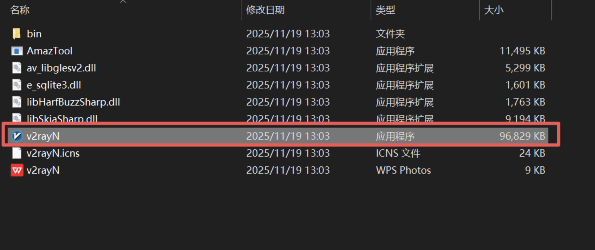

# 🚀 v2rayN - Recommended Windows Client

> ⚡ **Top Choice for Windows** | Multi-protocol support, comprehensive features, and easy to use.

**v2rayN** is the most popular graphical proxy client for Windows. Built on the .NET framework, it supports many mainstream proxy protocols, providing users with stable and efficient proxy services.

### 💻 System Requirements

| Item | Minimum | Recommended | Note |
|------|----------|----------|------|
| **OS** | Windows 10 (64-bit) | Windows 10/11 Latest | 64-bit systems only |
| **Processor** | Intel/AMD Dual Core | Quad Core or better | Supports mainstream architectures |
| **RAM** | 4GB RAM | 8GB+ RAM | Ensures smooth operation |
| **Storage** | 100MB+ | 500MB+ | For config and logs |
| **.NET** | .NET 6.0+ | Latest Version | Required environment |

## 📥 Official Safe Free Download

We provide a high-speed, free download channel. The file is hosted on cloud storage and is safe and virus-free.

| Version | Filename | Download Link |
| :--- | :--- | :--- |
| **Latest** | `v2rayN.zip` | [**⬇️ Click to Download**](https://download.onsucloud.com/v2rayN.zip) |

> ⚠️ **Important Note for Self-Downloading**
> 
> If you choose to find the installation package yourself, please ensure you use **official channels** (such as GitHub). Do not download modified versions from unknown sources to avoid malware.
> 
> **Special Attention**: Please ensure you download the **Latest Version**! Due to our support for the new Xray/Reality protocols, **older versions of the client may not connect**.

---

## 🚀 Step-by-Step Tutorial

### 🎯 Step 1: Start the Application

Download and unzip v2rayN to any folder, then double-click `v2rayN.exe` to launch the program.

> **First Run Prompt**: The program will automatically check the runtime environment. If components are missing, please install them as prompted. If a Windows security window pops up, click **More info**, then select **Run anyway**.

### 📋 Step 2: Get Subscription Link

> **Get Link**: **Copy the subscription link** from the User Center.

### 📥 Step 3: Import Subscription

> **Import Method**: Paste the subscription link in the subscription settings. Multiple subscriptions can be managed simultaneously.

### 🔄 Step 4: Update Subscription Nodes

> **Auto Update**: Update your subscription regularly to get the latest node information and configurations.

### ▶️ Step 5: Enable System Proxy

> **Proxy Mode**: You can choose between "Set system proxy", "PAC mode", or manual configuration.

### 🎛️ Step 6: Select Server Node

> **Node Selection**: Choose the most suitable server node based on speed test results and latency.

### ⏹️ Step 7: Stop Proxy Service

> **Safe Exit**: Remember to turn off the proxy ("Clear system proxy") when you are done to restore normal network settings.

---

## ❓ FAQ

### 🔧 Installation & Config

**Q: What if it says ".NET Framework missing" at startup?**

A: Steps to resolve:

1. Visit the Microsoft website to download .NET 6.0 or a higher version.
2. Restart your computer after installation.
3. Relaunch the v2rayN program.
4. If issues persist, try running as Administrator.

**Q: The program won't start or crashes?**

A: Troubleshooting:

1. Check if your system is 64-bit.
2. Confirm the .NET framework version is correct.
3. Temporarily disable antivirus software and try again.
4. Check if the program directory has write permissions.

### 🌐 Usage Issues

**Q: Subscription update failed?**

A: Solutions:

1. Check if your internet connection is normal.
2. Verify if the subscription link is valid.
3. Try copying the link manually and adding it again.
4. Check if it's being blocked by a firewall.

**Q: Connected but no internet access?**

A: Checklist:

1. Confirm "Set system proxy" is enabled.
2. Check browser proxy settings.
3. Try switching to a different server node.
4. Check the program logs for error messages.

**Q: The speed is very slow?**

A: Optimization tips:

1. Choose a server node with lower latency.
2. Try different protocol types (e.g., VMess vs Trojan).
3. Adjust connection count and timeout settings.
4. Use the speed test function to find the fastest node.

---
## 🎫 Need More Help?

If you encounter any issues during use, or if the FAQ above does not resolve your situation, please feel free to contact us:

Please log in to the website backend, go to **"User & Support"** → **"Ticket Management"** to submit a ticket.

> 💡 **We are here to serve you**
> 
> Upon receiving your ticket, our technical support team will investigate and resolve it as soon as possible. To improve efficiency, we recommend attaching **screenshots of errors** or a **detailed description** in your ticket.