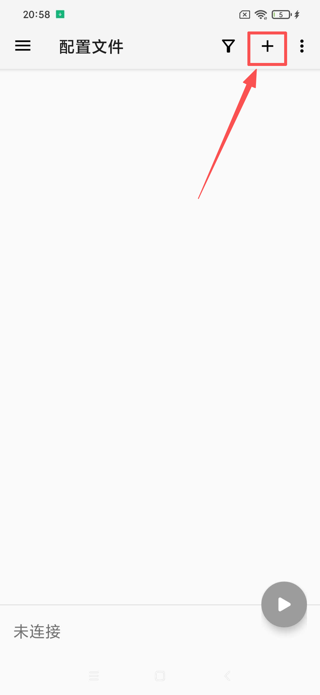

# 📱 v2rayNG - 强大的 Android 代理客户端

> 🚀 [v2rayNG](https://github.com/2dust/v2rayNG) 是 Android 平台上功能最强大的免费代理客户端之一，支持多种现代代理协议，界面简洁易用。

## ✨ 功能特点

### 🔧 支持协议

| 协议 | 状态 | 说明 |
|------|------|------|
| 🌟 VMess | ✅ | V2Ray 专用协议 |
| ⚡ VLESS | ✅ | 轻量级协议 |
| 🔒 Shadowsocks | ✅ | 经典加密协议 |
| 🧦 Socks | ✅ | 通用代理协议 |
| 🛡️ Trojan | ✅ | 伪装 HTTPS 流量 |
| 🔐 Wireguard | ✅ | 现代 VPN 协议 |

### 📋 系统要求

- **操作系统**：Android 5.0 (API 21) 及以上
- **适用设备**：安卓手机 / 平板电脑
- **权限需求**：网络访问、VPN 权限
- **存储空间**：约 20MB

## 📥 下载安装

### 🔗 官方下载

> ⚠️ **注意**：请从官方渠道下载，确保软件安全性

| 下载源 | 类型 | 链接 |
|--------|------|------|
| 🏠 GitHub 官方 | APK | [v2rayNG_1.9.33_universal.apk](https://github.com/2dust/v2rayNG/releases/download/1.9.33/v2rayNG_1.9.33_universal.apk) |
| 🚀 加速镜像1 | APK | [下载地址](https://git.886.be/https://github.com/2dust/v2rayNG/releases/download/1.9.33/v2rayNG_1.9.33_universal.apk) |
| 🚀 加速镜像2 | APK | [下载地址](https://gh.xxooo.cf/https://github.com/2dust/v2rayNG/releases/download/1.9.33/v2rayNG_1.9.33_universal.apk) |
| 📱 备用地址 | APK | [下载地址](https://dl.v2rayng.org/releases/latest/v2rayNG_1.8.12.apk) |

### 🛠️ 安装步骤

1. **下载应用**
   - 选择上述任一下载链接
   - 下载 `v2rayNG_x.x.x.apk` 文件

2. **允许安装**
   - 进入手机 `设置` → `安全` → 开启 `未知来源应用安装`
   - 或在安装时选择 `允许安装此应用`

3. **安装应用**
   - 点击下载的 APK 文件
   - 按提示完成安装

4. **首次启动**

   

   > 💡 安装完成后打开应用，进入配置文件管理界面

---

## 🚀 使用教程

### 📝 步骤一：导入订阅链接

#### 1️⃣ 复制订阅地址

从服务提供商处获取订阅链接，复制到剪贴板。

#### 2️⃣ 导入订阅

点击右上角的 `+` 按钮，选择 `导入订阅`：

#### 3️⃣ 粘贴链接

将复制的订阅链接粘贴到输入框中，点击 `确定`：

---

### 🔄 步骤二：更新订阅节点

#### 1️⃣ 长按订阅组

在主界面长按订阅组，选择 `更新订阅`：

#### 2️⃣ 等待更新完成

系统会自动拉取最新的节点列表：

---

### 🌐 步骤三：连接节点

#### 1️⃣ 选择节点

在节点列表中选择合适的服务器：

#### 2️⃣ 启动连接

点击右下角的连接按钮开始代理：

> ✅ **连接成功**
>
> - 状态栏显示 VPN 图标
> - 连接按钮变为已连接状态
> - 可以正常访问网络

---

## 🎯 高级功能

### ⚙️ 路由设置

- **绕过局域网**：本地流量直连
- **分应用代理**：指定应用使用代理
- **自定义规则**：高级路由配置

### 📊 流量统计

- **实时统计**：查看当前连接流量
- **历史记录**：分析流量使用情况
- **节点测试**：检测节点延迟和速度

---

## ❓ 常见问题

### 🔧 连接问题

**Q: 无法连接到服务器？**

A: 请检查：

- 网络连接是否正常
- 订阅链接是否有效
- 服务器节点是否可用
- 是否允许 VPN 权限

**Q: 速度很慢？**

A: 建议：

- 切换其他节点
- 检查本地网络质量
- 选择延迟较低的服务器

### 📱 应用问题

**Q: 应用无法安装？**

A: 请确认：

- Android 版本兼容性
- 是否允许未知来源安装
- 存储空间是否充足

---

## 📚 相关链接

- 🏠 [项目主页](https://github.com/2dust/v2rayNG)
- 📖 [使用文档](https://github.com/2dust/v2rayNG/wiki)
- 🐛 [问题反馈](https://github.com/2dust/v2rayNG/issues)
- 💬 [社区讨论](https://t.me/v2rayNG)

---

> 📅 最后更新：2025年7月10日 | 📱 适用版本：v2rayNG 1.9.33

