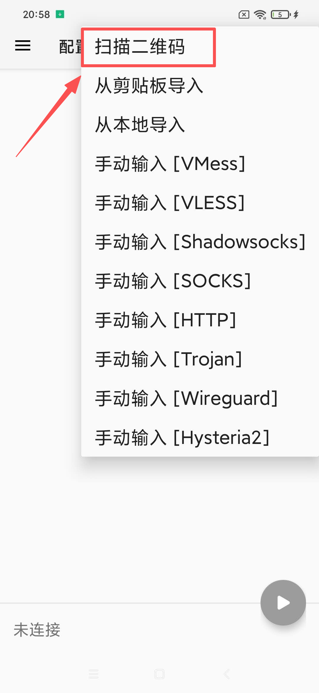
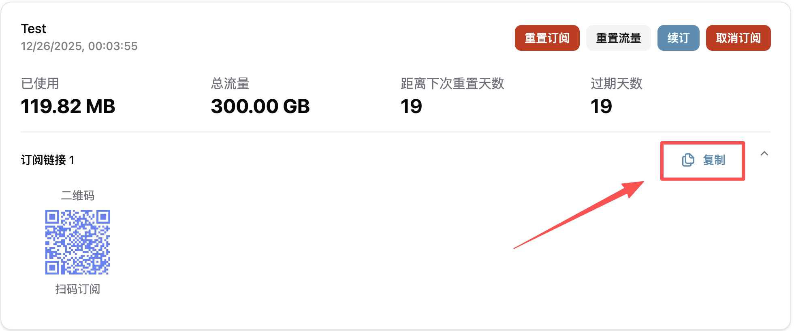
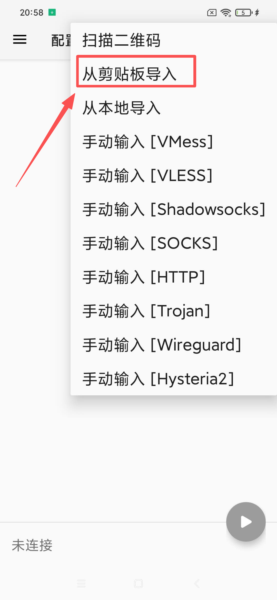
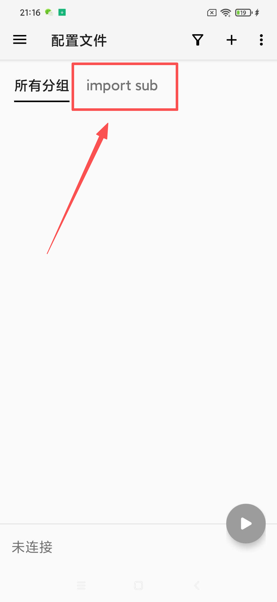
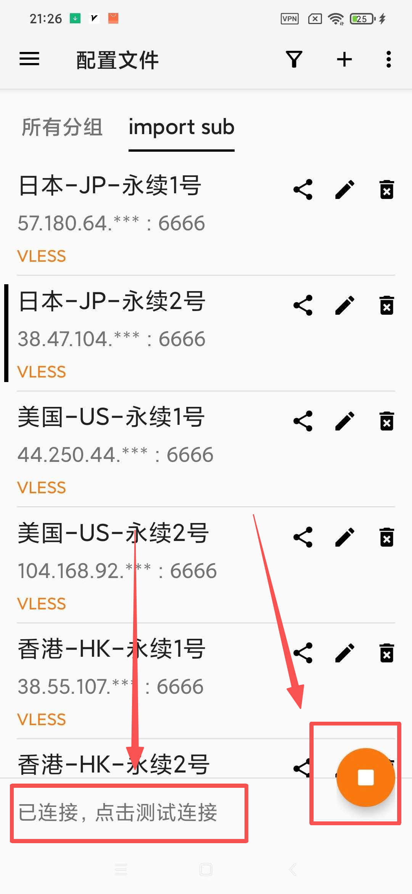

# 📱 v2rayNG - Android 推荐客户端

> ⚡ **最流行的 Android 代理工具** | 开源、强大，完美支持 Xray/VLESS Reality 协议

**v2rayNG** 是 Android 平台上最广泛使用的代理客户端，由 Windows 端 v2rayN 的同团队开发。它功能全面，界面友好，是我们推荐安卓用户首选的连接工具。

### 📋 系统要求

- **操作系统**：Android 5.0 及以上
- **适用设备**：安卓手机 / 平板电脑 / 墨水屏设备
- **权限需求**：网络访问、VPN 配置权限

---

## 📥 官方安全免费下载

我们为您提供了高速免费下载通道，文件托管于云端存储，安全无毒。

| 版本 | 文件名 | 下载链接 |
| :--- | :--- | :--- |
| **最新版** | `v2rayNG.apk` | [**⬇️ 点击直接下载**](https://download.onsucloud.com/v2rayNG.apk) |

> ⚠️ **自主下载重要提示**
> 
> 如果您选择自行寻找安装包，请务必认准 **官方发布渠道** (如 GitHub 或 Google Play)，切勿下载来路不明的修改版，以免手机中毒。
> 
> **特别注意**：请务必下载 **最新版本**！由于我们需要支持 Xray/Reality 新协议，**部分老版本客户端将无法连接**。

---

## 🛠️ 安装步骤

1. **下载文件**：点击上方链接，下载 `.apk` 安装包。
2. **允许权限**：如果系统提示“禁止安装未知来源应用”，请前往 `设置` → `安全` 开启允许，或在弹窗中点击 `允许本次安装`。
3. **完成安装**：点击安装包完成安装，随后打开 App。

---

## 🚀 使用教程

### 1️⃣ 第一步：导入订阅

**方法 A：二维码一键导入（推荐）**
#### 1. 打开 v2rayNG，点击左上角的 ☰ 菜单图标（或右上角 + 号）。

#### 2. 选择**扫描二维码**。

#### 3. 使用浏览器登录您的账号，找到您的订阅信息，并使用手机**扫描二维码**。
   

**方法 B：复制链接导入**
#### 1. 从用户中心**复制订阅链接**。

#### 2. 打开 v2rayNG，点击左上角的 `☰` 菜单图标（或右上角 `+` 号）。

#### 3. 选择 **「从剪贴板导入」**。

### 2️⃣ 第二步：更新订阅（重要）
#### 1. 导入后，回到APP主页，选择**import sub**，这时即可看到全部可用节点。

#### 2. 建议手动更新一次以获取最新节点。
- 点击右上角的 **三竖点** `⋮` 图标。

- 选择 **「更新订阅」**。

### 3️⃣ 第三步：连接使用

#### 1. **选择节点**：点击列表中任意一个节点（选中后左侧会有绿色竖条）。
#### 2. **启动连接**：点击右下角类似 **播放** 图标。

#### 3. **授权 VPN**：首次连接会弹出系统网络请求，请点击 **“确定”** 或 **“允许”**。

> ✅ **连接成功标志**：
> * 底部显示已连接。

> * 手机顶部状态栏出现 `VPN` 或钥匙图标。
> * 打开浏览器可正常访问 Google/YouTube。

---

## ❓ 常见问题

### 🔧 连接问题

**Q: 无法连接到服务器？**

A: 请检查：

- 网络连接是否正常
- 订阅链接是否有效
- 服务器节点是否可用
- 是否允许 VPN 权限

**Q: 速度很慢？**

A: 建议：

- 切换其他节点
- 检查本地网络质量
- 选择延迟较低的服务器

### 📱 应用问题

**Q: 应用无法安装？**

A: 请确认：

- Android 版本兼容性
- 是否允许未知来源安装
- 存储空间是否充足

---
## 🎫 需要更多帮助？

如果您在使用过程中遇到任何问题，或者上述 FAQ 无法解决您的情况，请随时联系我们：

请登录网站后台，点击 **「用户支持」** → **「工单管理」** 向我们提交工单。

> 💡 **我们随时为您服务**
> 
> 收到您的工单后，我们的技术支持团队会尽快为您排查并处理。为了提高解决效率，建议您在工单中附上**报错截图**或**详细描述**。