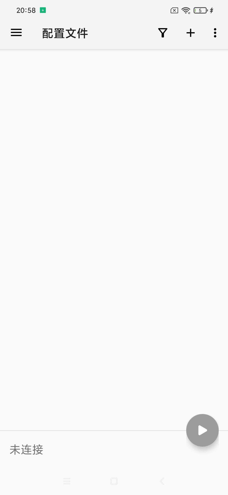
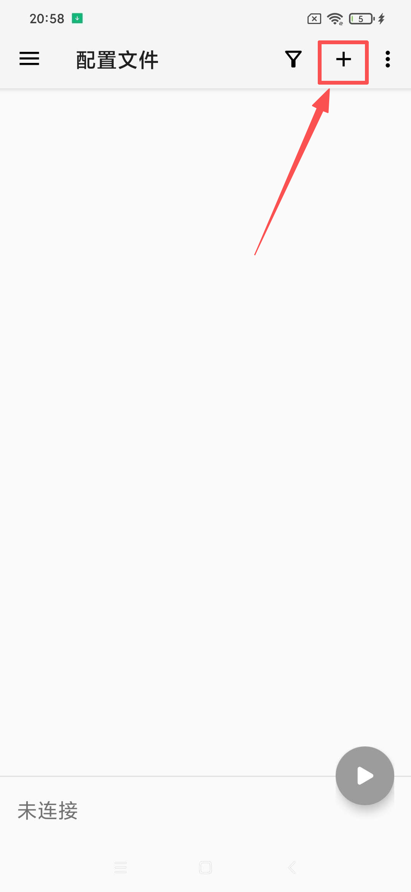
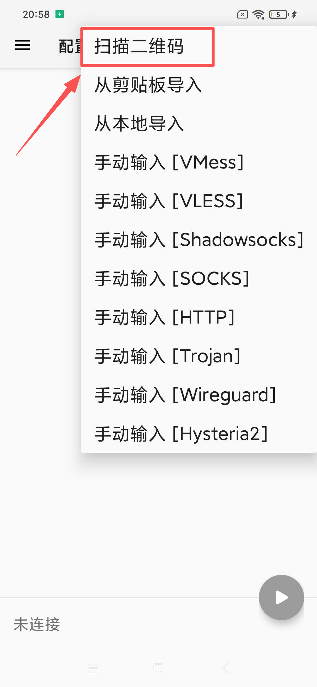
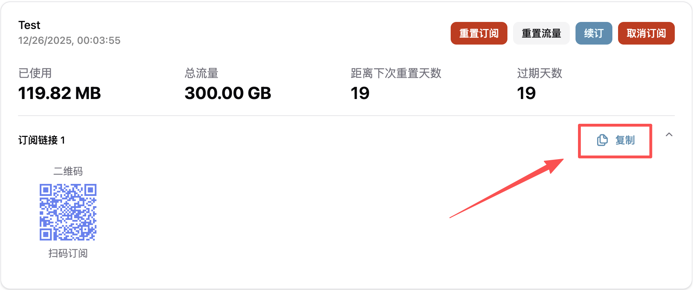
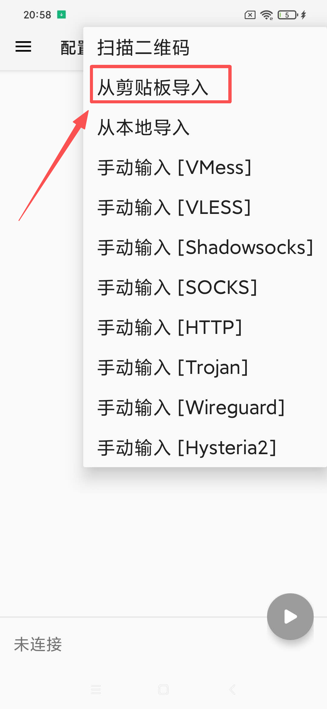
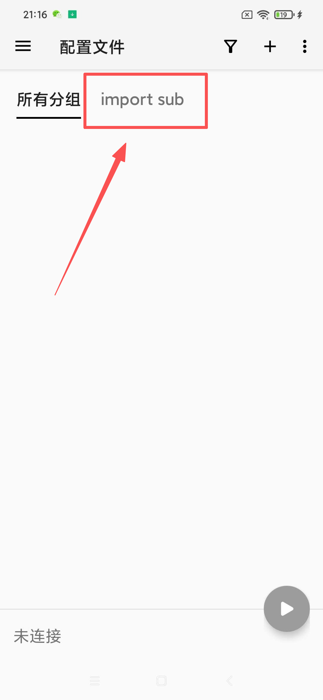
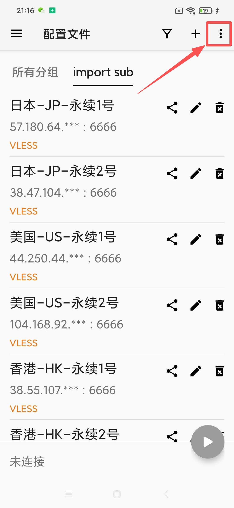
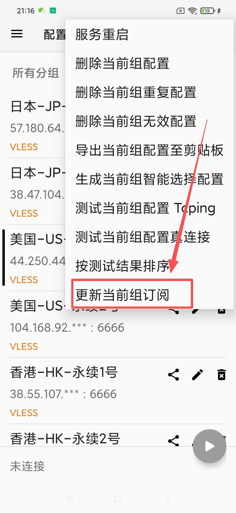
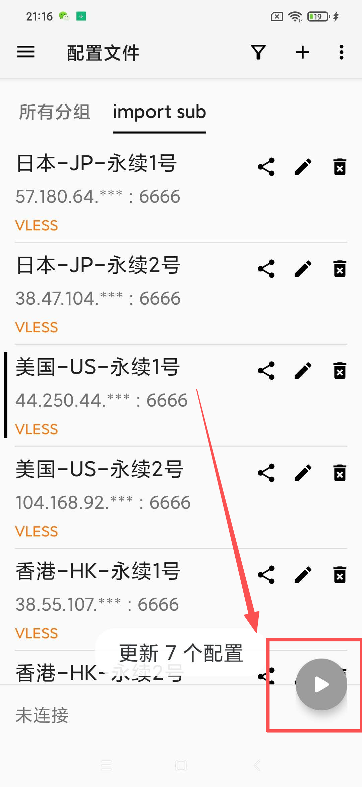
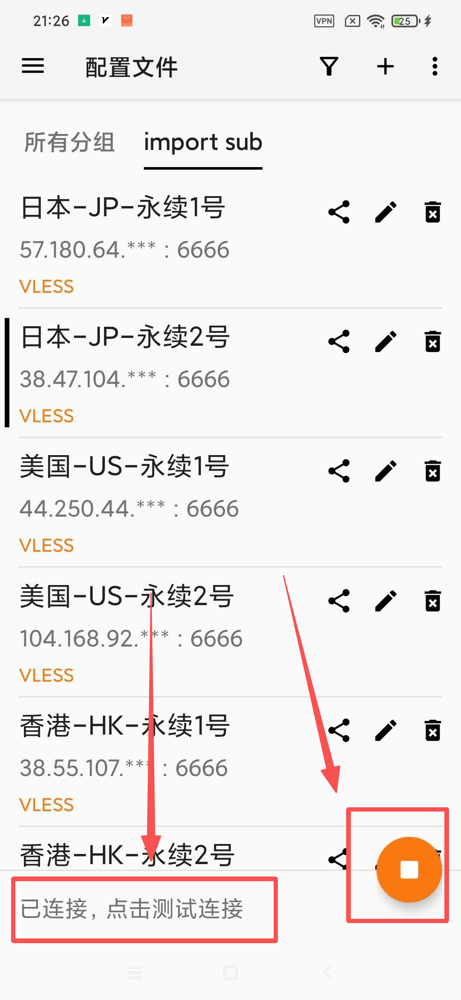

# v2rayNG（Android）

这篇按最快能用来写，新手直接照着做就行。

## 第 0 步：安装 App

| 版本 | 文件名 | 下载链接 |
| :--- | :--- | :--- |
| 最新版 | `v2rayNG.apk` | [⬇️ 点击直接下载](https://download.onsucloud.com/v2rayNG.apk) |

安装时如果系统拦截：

1. 允许安装未知来源应用
2. 完成安装后打开 App

## 第 1 步：导入订阅

### 方法 A：二维码导入

先点右上角 `+`。

然后选择扫描二维码。

再去用户中心找到二维码，直接扫描。

### 方法 B：复制链接导入

先在用户中心复制订阅链接。

回到 v2rayNG，点右上角 `+`。

选择 **“从剪贴板导入”**。

## 第 2 步：确认节点已经出现

导入后，回到首页，进入订阅分组，就能看到节点。

如果这里还是空的，通常是导入失败，重新复制订阅链接再导一次。

## 第 3 步：更新订阅 （很重要）

点击右上角三点菜单。

选择 **“更新订阅”**。

这一步很重要，建议每次导入后都手动更新一次，也建议定期更新订阅因为我们会定期更新节点服务器配置。如果出现连不上，速度慢等等优先更新订阅！

## 第 4 步：连接

先点一个节点，再点右下角连接按钮。

第一次连接时，系统会弹出 VPN 请求，点 **“允许”** 或 **“确定”**。

## 成功标志

- 底部显示已连接
- 顶部状态栏出现 `VPN` 或钥匙图标
- 浏览器可以正常打开目标网站

## 最容易踩坑的地方

- **只导入了订阅，但没点连接**
- **第一次弹 VPN 权限时点了拒绝**
- **导入后没更新订阅**
- **复制错内容**：必须复制订阅链接本身
- **节点存在但当前节点不可用**：换一个节点试试

## 还不行怎么办

先按这个顺序排查：

1. 本机网络是否正常
2. 订阅链接是否复制完整
3. 是否已经更新订阅
4. 是否已允许 VPN
5. 是否换过其他节点

如果还不行，请到后台提交工单，并附上截图。
