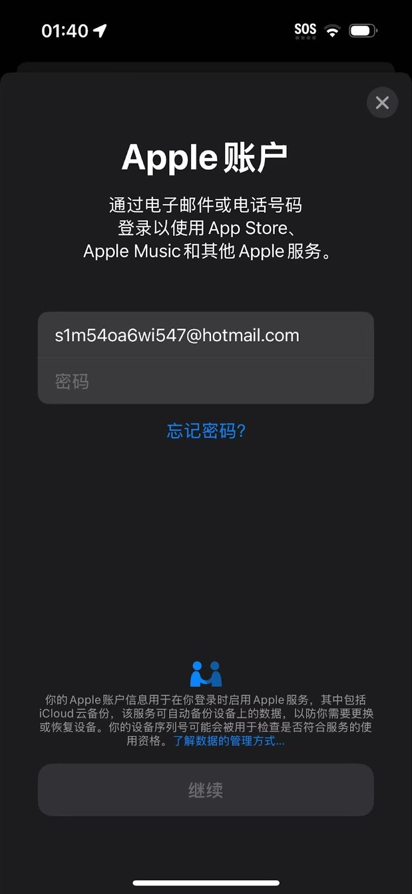
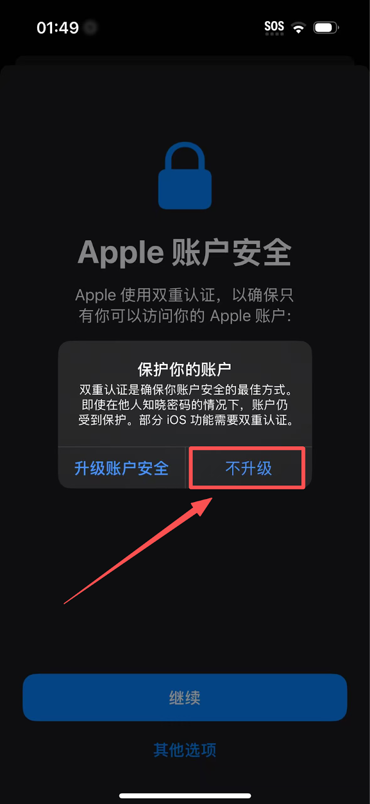
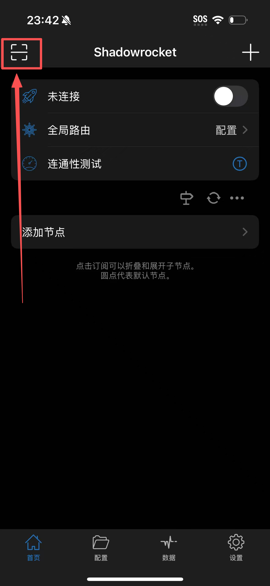

# 🚀 Shadowrocket - 经典小火箭

> 🎯 Shadowrocket（小火箭）是 iOS 平台上最受欢迎的轻量级代理工具，以其简洁的界面、稳定的性能和实惠的价格深受用户喜爱。

### 📱 系统兼容

- **最低要求**：iOS 9.0 或更高版本
- **推荐版本**：iOS 12.0 及以上
- **兼容设备**：iPhone / iPad / iPod Touch
- **存储需求**：约 50MB 可用空间

---

## 📥 获取安装

### 🏪 官方渠道（唯一选择）

> ⚠️ **重要提醒**
>
> - 中国大陆 App Store **无法下载**
> - 需要使用**非中国大陆 Apple ID**
> - 建议选择美区、港区等账号

---

### 🔑 Apple ID 获取
#### 方法一：免费获取已拥有Shadowrocket的账号 (推荐)

##### 1. 访问 **[免费Shadowrocket账号发布社区](https://ids.ailiao.eu/)**
##### 2. 找到一个刚刚更新的账号，直接选择**复制账号**，**复制密码**

> 💡 **付费说明**：
> 以下的方法二和方法三适合希望拥有**独立永久账号**的用户。
> 这需要您自行注册外区 ID 并充值购买 Shadowrocket（售价 **2.99美金**）。

#### 方法二：自行注册

1. 访问 [appleid.apple.com](https://appleid.apple.com)
2. 选择非中国大陆地区
3. 完成邮箱验证和信息填写

#### 方法三：购买现成账号

- 选择信誉良好的商家
- 注意账号安全和售后服务
- 建议购买后及时修改密码

---
### 🔑 Apple ID 账号切换

> 💡 **提示**：如果您已经是外区（非中国大陆）账号，请忽略此步骤，直接去 App Store 下载即可。只有大陆 Apple ID 用户需要执行此切换操作。

#### 1. 打开 **App Store**。

#### 2. 点击右上角的 **个人头像** 图标。

#### 3. 将页面 **滑动至最底部**。

#### 4. 点击 **退出登录 (Sign Out)**。

#### 5. 页面刷新后回到顶部，输入您刚刚获取的 **外区 Apple ID 和密码**，点击登录。

> ⚠️ **高风险预警：如果您采取的是方法一获取Apple ID，切勿在设置中登录！**
> * **绝对不要**在手机系统的「设置」或「iCloud」中登录此共享账号，否则可能导致手机被锁死！
> * **只能**在 **App Store** 软件内登录。

#### 6. **‼️关键步骤**：登录时若弹出安全验证，请务必选择 **「其他选项」** -> **「不升级」**。
- (注意：如果选错导致开启双重认证，可能会导致后续无法登录)*

#### 7. 登录成功后，搜索 `Shadowrocket`。
- 请认准开发商为 **Shadow Launch Technology Limited**。
- 点击下载图标（如果是付费账号，显示为云下载图标是正常的，无需再次付费）。

#### 8. **‼️ 关键步骤**：下载完成后，请务必**立即退出**该临时账号，并换回您自己的 Apple ID。
---

## 🚀 配置教程
开始配置前，请确保：

- ✅ 已成功安装 Shadowrocket

### 🛠️ 导入配置

#### 🔗 方法一：订阅链接导入

##### 步骤 1：打开应用

启动 Shadowrocket，进入主界面：

##### 步骤 2：添加订阅

点击右上角的 `+` 号，选择 `Subscribe`：

##### 步骤 3：粘贴链接

在 URL 框中粘贴订阅链接，点击完成：

##### 步骤 4：更新订阅

拖动订阅条目，点击 `Update` 更新节点：

#### 📱 方法二：二维码扫描

##### 1. 点击左上角的扫描图标

##### 2. 扫描您主页订阅的二维码

##### 3. 自动识别并导入配置

---

## 🌐 使用指南

### 🎯 连接服务器

1. **选择节点**：在主界面选择合适的服务器
2. **启动连接**：点击顶部开关启用代理
3. **确认权限**：首次使用需授予 VPN 权限
4. **验证连接**：检查状态栏 VPN 图标

---

## ❓ 常见问题

### 🔧 连接问题

**Q: 连接失败怎么办？**

A: 检查排查步骤：

- 确认服务器信息正确
- 检查网络连接状态
- 尝试切换其他节点
- 重启应用或设备

**Q: 速度慢或不稳定？**

A: 优化建议：

- 选择延迟较低的节点
- 避开网络高峰期使用
- 检查本地网络质量
- 联系服务商客服

### 📱 应用问题

**Q: 应用闪退或卡顿？**

A: 解决方案：

- 重启应用
- 重启设备
- 检查 iOS 版本兼容性
- 清理设备存储空间

**Q: 无法下载应用？**

A: 注意事项：

- 确认使用的是外区 Apple ID
- 检查账号是否有效
- 尝试切换不同地区账号

---
## 🎫 需要更多帮助？

如果您在使用过程中遇到任何问题，或者上述 FAQ 无法解决您的情况，请随时联系我们：

请登录网站后台，点击 **「用户支持」** → **「工单管理」** 向我们提交工单。

> 💡 **我们随时为您服务**
> 
> 收到您的工单后，我们的技术支持团队会尽快为您排查并处理。为了提高解决效率，建议您在工单中附上**报错截图**或**详细描述**。