# Shadowrocket（iPhone / iPad）

这篇只保留新手真正需要的步骤。

## 第 0 步：先把 App 下好

### 重要提醒

- 中国大陆 App Store 一般下不到 Shadowrocket
- 需要非中国大陆 Apple ID
- 如果你用的是共享账号，**⚠️⚠️切记只能在 App Store 内登录！**
- **⚠️⚠️千万千万不要在系统设置 / iCloud 里登录共享账号！**

### 获取可用账号

如果您有自己的外区账号，目前Shadowrocket需要付费3美金购买，您如果愿意购买那自行下载Shadowrocket即可，这里只教不想额外花钱或者没有外区苹果账号的老板如何下载

如果你使用共享账号，可以先访问 [免费Shadowrocket账号发布社区](https://ids.ailiao.eu/) 复制账号和密码：

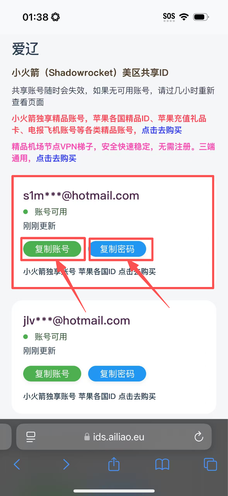

### 在 App Store 里切换账号

1. 打开 **App Store**

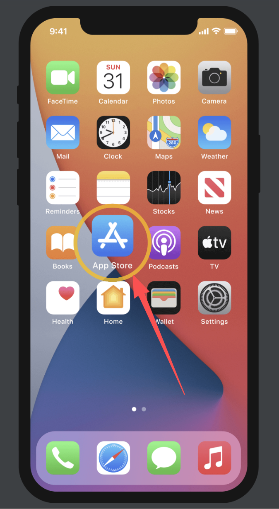

2. 点右上角头像

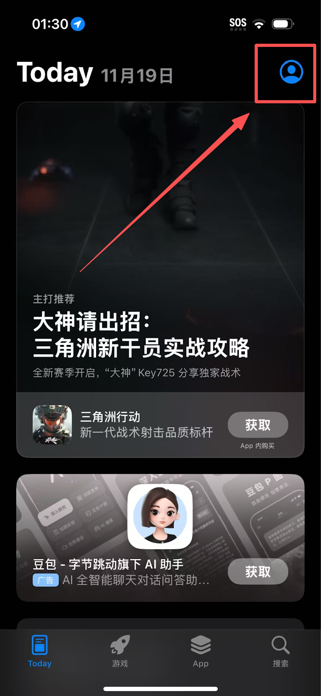

3. 页面拉到底，退出当前账号

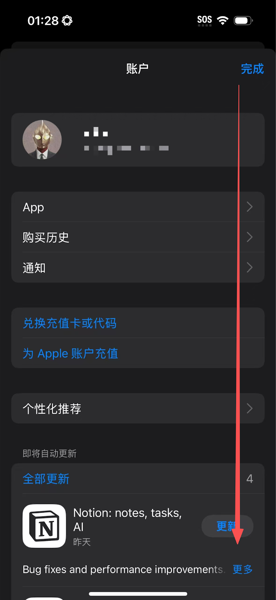
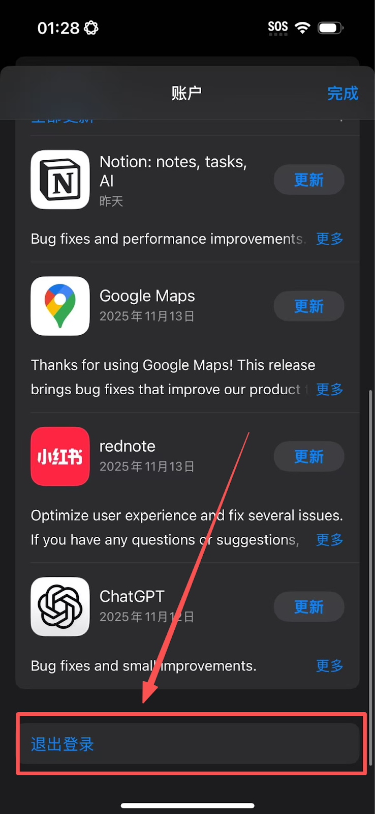

4. 回到顶部，输入外区 Apple ID 和密码登录

> ⚠️⚠️ **再次强调高风险预警：如果您采取的是共享Apple ID，切勿在设置中登录！**
> * **绝对不要**在系统的「设置」或「iCloud」中登录此共享账号，否则可能导致被锁死！
> * **只能**在 **App Store** 软件内登录!!

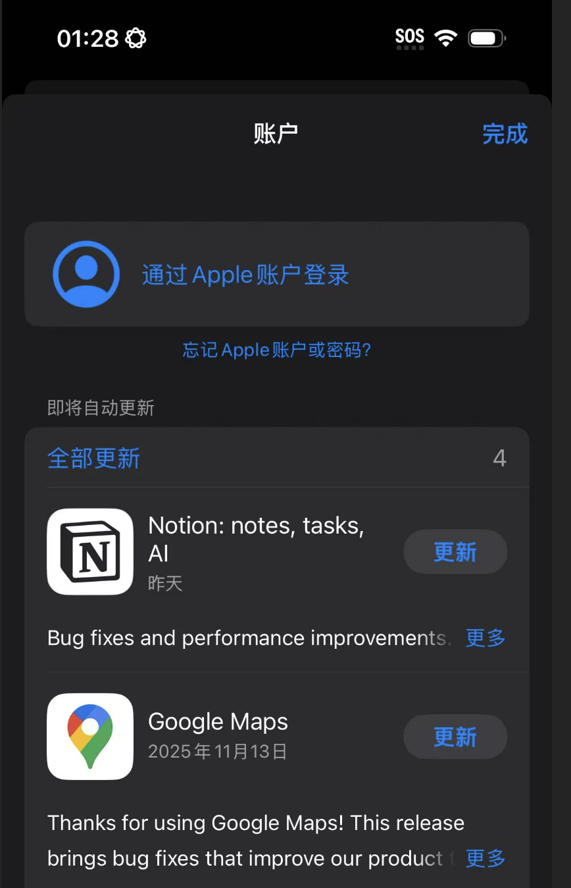
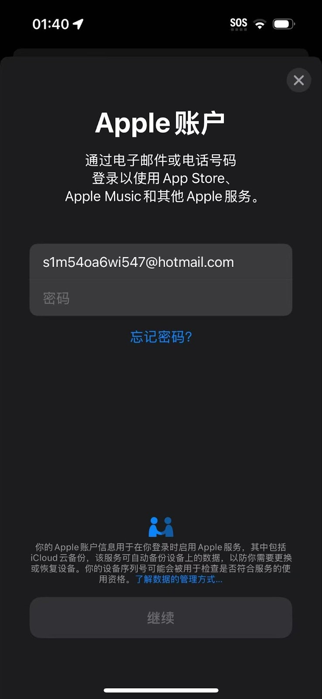

5. 如果弹出安全提示，选 **“其他选项”** → **“不升级”**

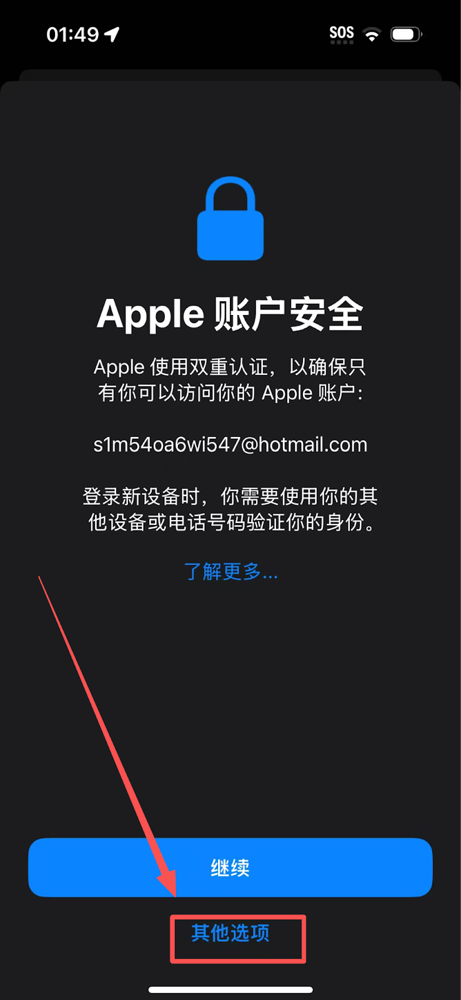
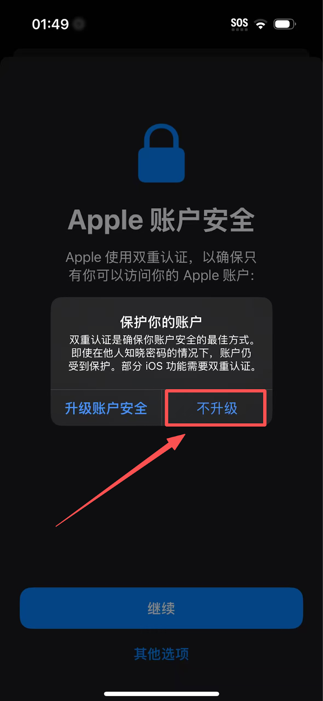

6. 搜索 `Shadowrocket`，认准开发商 **Shadow Launch Technology Limited**，然后下载

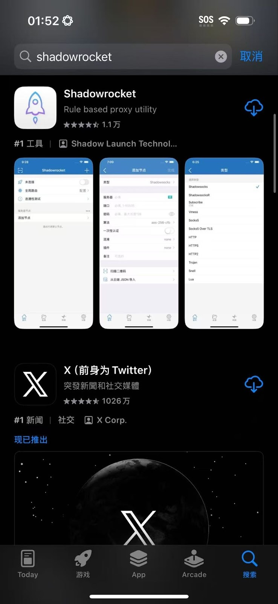
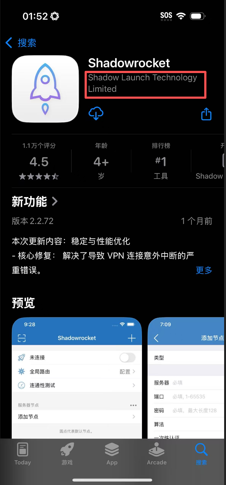

7. 下载完成后，**记得及时退出共享账号！**

## 第 1 步：打开 Shadowrocket

打开 App 后进入主界面。

## 第 2 步：导入订阅

### 方法 A：订阅链接导入

点右上角 `+`，选择 `Subscribe`。

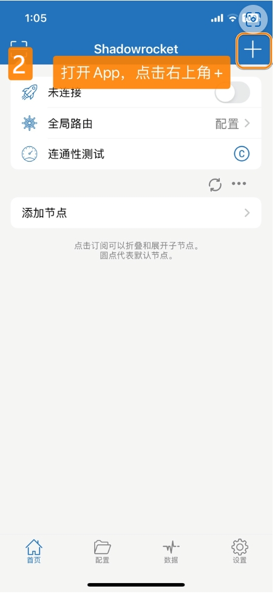

把你在用户中心复制的订阅链接粘贴到 URL 里，然后保存。

### 方法 B：二维码导入

点左上角扫描图标。

扫描用户中心里的订阅二维码。

## 第 3 步：更新订阅 （很重要）

这一步很重要，建议每次导入后都手动更新一次，也建议定期更新订阅因为我们会定期更新节点服务器配置。如果出现连不上，速度慢等等优先更新订阅！

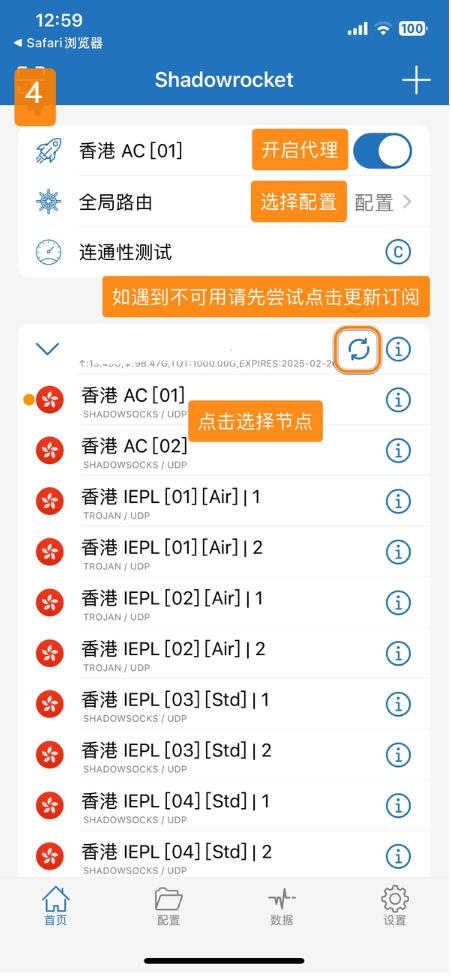

不更新的话，节点可能不完整，或者拿到的是旧节点。

## 第 4 步：选择节点并连接

1. 在主界面选一个节点
2. 打开顶部开关
3. 第一次连接时允许 VPN

## 成功标志

- 开关已经打开
- 状态栏出现 VPN 图标
- 浏览器可以正常打开目标网站

## 最容易踩坑的地方

- **共享 Apple ID 登录到了系统设置里**：这是最危险的错误，只能在 App Store 登录。
- **下载完没退出共享账号**
- **导入了订阅，但没更新**
- **没打开顶部开关**
- **第一次 VPN 授权点了拒绝**

## 还不行怎么办

按这个顺序排查：

1. 是否已经成功下载正版 Shadowrocket
2. 是否导入的是完整订阅链接
3. 是否更新过订阅
4. 是否换过其他节点
5. 是否已允许 VPN

如果还不行，请提交工单并附上截图。
