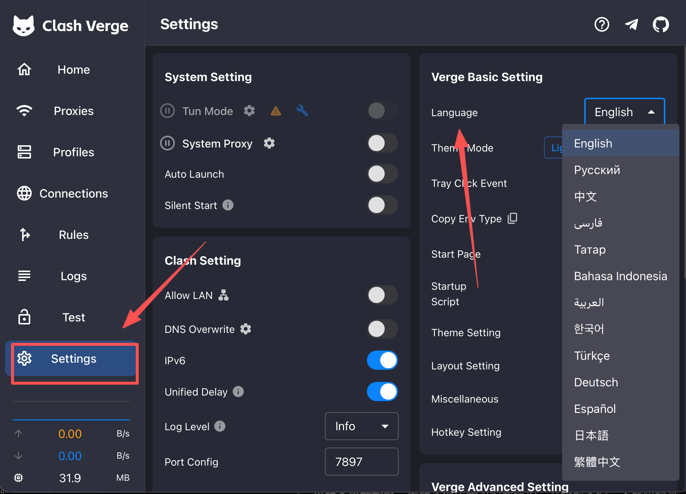
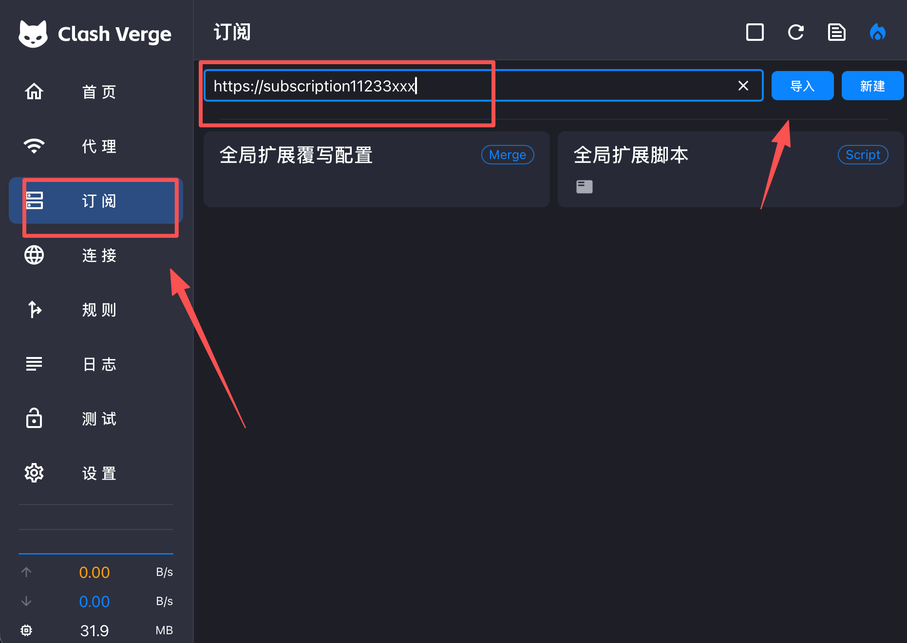
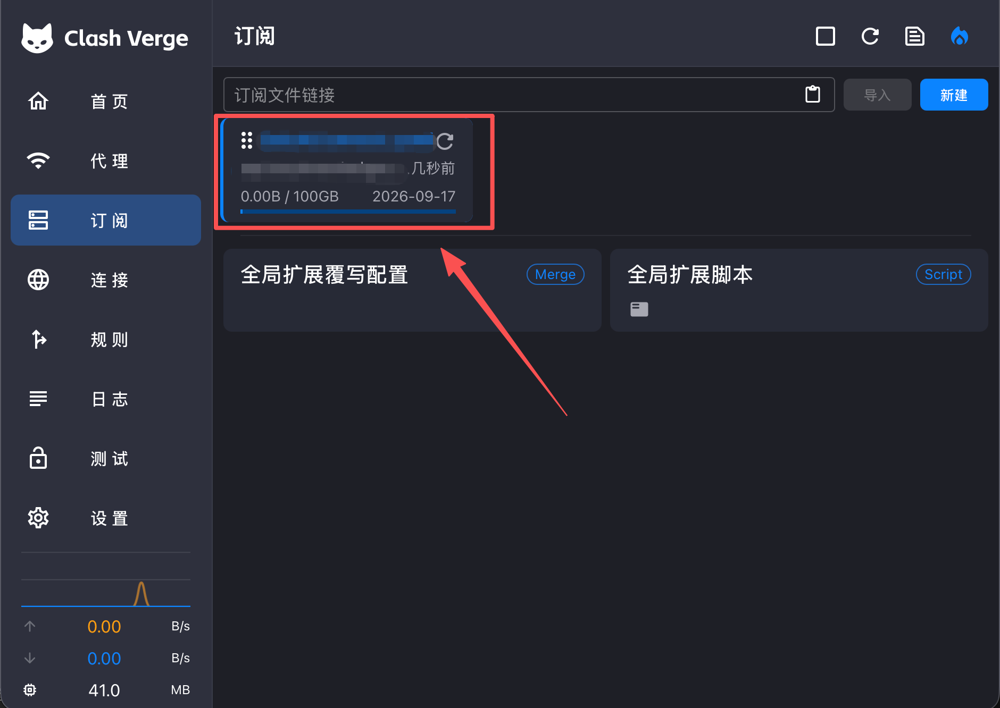
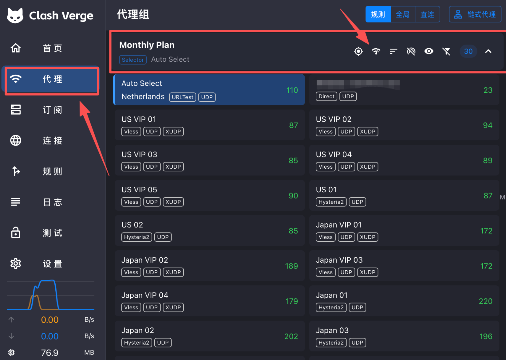
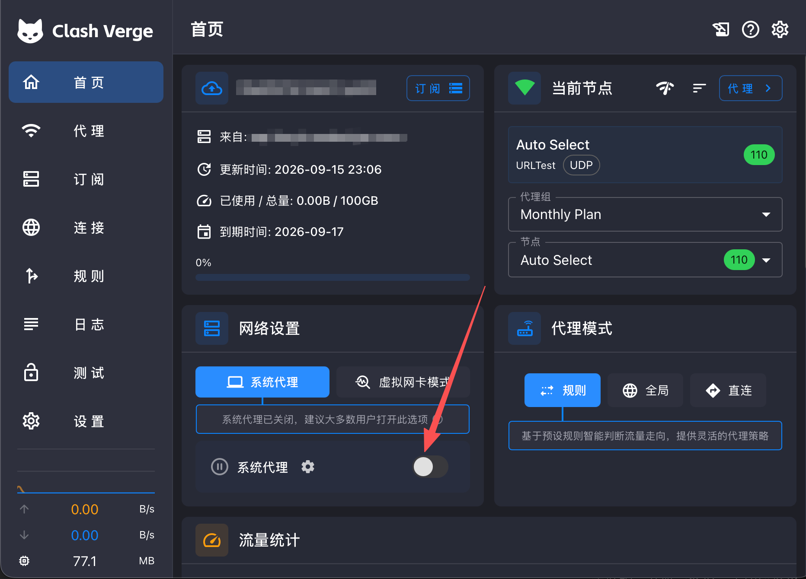

# Clash Verge（macOS）

这篇只讲新手怎么尽快配置成功。下面使用 Clash Verge Rev 的中文界面，界面和 Windows 版基本一致。

## 第 0 步：下载安装

请根据网络情况选择下载入口：

| 下载入口 | 适用设备 | 链接 |
| :--- | :--- | :--- |
| 国内镜像快速下载（推荐） | Apple 芯片 Mac | [下载 Apple 芯片版 v2.5.2](https://dl.onsucloud.com/https://github.com/clash-verge-rev/clash-verge-rev/releases/download/v2.5.2/Clash.Verge_2.5.2_aarch64.dmg) |
| 国内镜像快速下载（推荐） | Intel Mac | [下载 Intel 版 v2.5.2](https://dl.onsucloud.com/https://github.com/clash-verge-rev/clash-verge-rev/releases/download/v2.5.2/Clash.Verge_2.5.2_x64.dmg) |
| 官方入口 | Apple 芯片或 Intel Mac | [打开 GitHub 官方发布页](https://github.com/clash-verge-rev/clash-verge-rev/releases/latest) |

> Apple 芯片请选择 `aarch64.dmg`，Intel Mac 请选择 `x64.dmg`。

| Mac 类型 | 选择的文件 |
| :--- | :--- |
| Apple 芯片（M1/M2/M3/M4 等） | 文件名包含 `aarch64.dmg` |
| Intel 芯片 | 文件名包含 `x64.dmg` |

不确定芯片类型时，点击左上角 **Apple 菜单 → 关于本机** 查看。下载后打开 `.dmg`，把 Clash Verge 拖入「应用程序」。

如果 macOS 阻止首次打开：

1. 在「应用程序」中右键 Clash Verge，选择 **打开**。
2. 仍然无法打开时，前往 **系统设置 → 隐私与安全性**，找到拦截提示后点击 **仍要打开**。

## 第 1 步：切换中文

打开 Clash Verge，进入 **Settings**，把 **Language** 改为 **中文**。如果界面没有立即变化，退出软件后重新打开。

## 第 2 步：复制并导入订阅

先到用户中心复制完整的 **订阅链接**。订阅链接相当于账号凭证，请不要发给其他人或公开到网上。

回到 Clash Verge：

1. 点击左侧 **订阅**。
2. 把订阅链接粘贴到顶部输入框。
3. 点击右侧 **导入**。

> 不要点「新建」手动编写配置；一般用户直接粘贴订阅链接并点「导入」即可。

## 第 3 步：确认导入并刷新订阅

导入成功后，页面上会出现一张订阅卡片，通常会显示流量、到期时间和更新时间。如果有多个订阅，点击需要使用的卡片。

点击卡片右上角的 **旋转箭头** 可以手动刷新订阅。刚导入后建议先刷新一次；以后如果节点变少、连不上或速度异常，也先刷新订阅。

## 第 4 步：测速并选择节点

1. 点击左侧 **代理**。
2. 在要使用的代理组中，点击上方的 **Wi-Fi 形状按钮**进行延迟测试。
3. 等待测试完成，点击一个可用节点。

数字的单位是毫秒（ms），通常越小响应越快，但实际速度还会受节点负载和网络状况影响。如果不知道选哪个，可以先选 **Auto Select**，或选一个延迟较低的节点。

## 第 5 步：开启系统代理

1. 点击左侧 **首页**。
2. 代理模式保持 **规则**（推荐）。
3. 打开 **系统代理** 开关。
4. macOS 如果请求网络或管理员权限，请按系统提示允许。

开关开启后，用浏览器打开需要代理的网站测试。如果打不开，先回到「代理」换一个节点，再刷新网页。

### 代理模式怎么选

- **规则**：按订阅中的规则自动分流，日常使用推荐选这个。
- **全局**：大部分流量都经过代理，仅适合临时排查。
- **直连**：不经过节点，选中后就不会走代理。

## 用完怎么关闭

回到「首页」，关闭 **系统代理**。建议先关开关再退出软件，避免系统保留无效代理设置。

## 成功标志

- 「订阅」页能看到订阅卡片，刷新没有报错。
- 「代理」页能看到节点，测速后有延迟数字。
- 已选择节点，并开启「系统代理」。
- 浏览器可以正常打开目标网站。

## 最容易踩坑的地方

- **导入后没有节点**：点击订阅卡片的旋转箭头；仍然为空时，重新复制完整订阅链接。
- **有节点但不能上网**：检查「系统代理」是否已开启，然后换一个测速正常的节点。
- **所有节点都超时**：先刷新订阅，再检查本机网络、订阅是否过期。
- **只有部分软件不走代理**：部分应用不遵循系统代理。新手先不要随意开启虚拟网卡/TUN；确认基本步骤无误后再联系客服排查。
- **和其他代理软件同时运行**：系统代理设置可能冲突，请先退出其他代理软件。

## 还不行怎么办

请登录网站后台，点击 **「用户支持」→「工单管理」** 提交工单。

建议附上：

- 「订阅」和「代理」页截图（请遮住订阅链接）
- 当前选中的节点
- 错误提示和你卡住的步骤
