# Shadowrocket（Mac）

这篇只保留新手真正需要的步骤。

## 第 0 步：先把 App 下好

### 重要提醒

- 中国大陆 App Store 一般下不到 Shadowrocket
- 需要非中国大陆 Apple ID
- 如果你用的是共享账号，**⚠️⚠️切记只能在 App Store 内登录！**
- **⚠️⚠️千万千万不要在系统设置 / iCloud 里登录共享账号！**

### 获取可用账号

如果您有自己的外区账号，目前Shadowrocket需要付费3美金购买，您如果愿意购买那自行下载Shadowrocket即可，这里只教不想额外花钱或者没有外区苹果账号的老板如何下载

如果你使用共享账号，可以先访问 [免费Shadowrocket账号发布社区](https://ids.ailiao.eu/) 复制账号和密码：

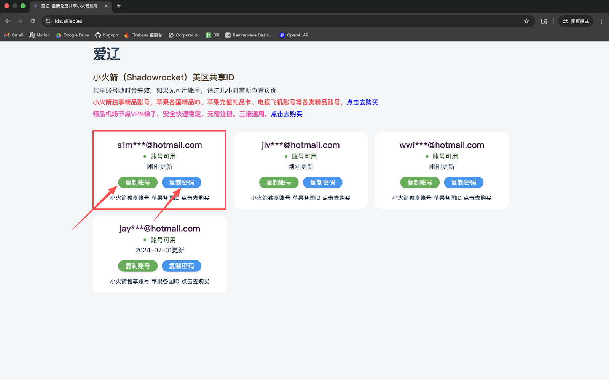

#### 1. 请打开设置，并点击**Apple账户**。
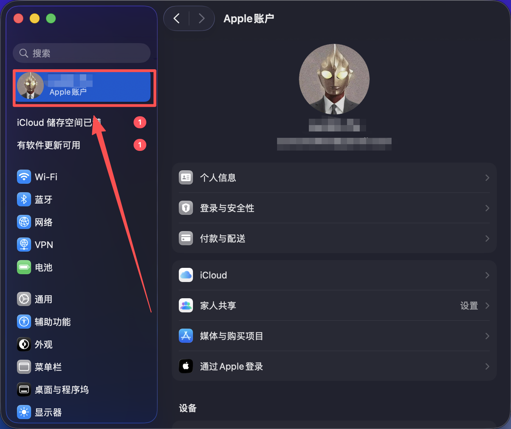

#### 2. 点击**媒体与购买项目**。
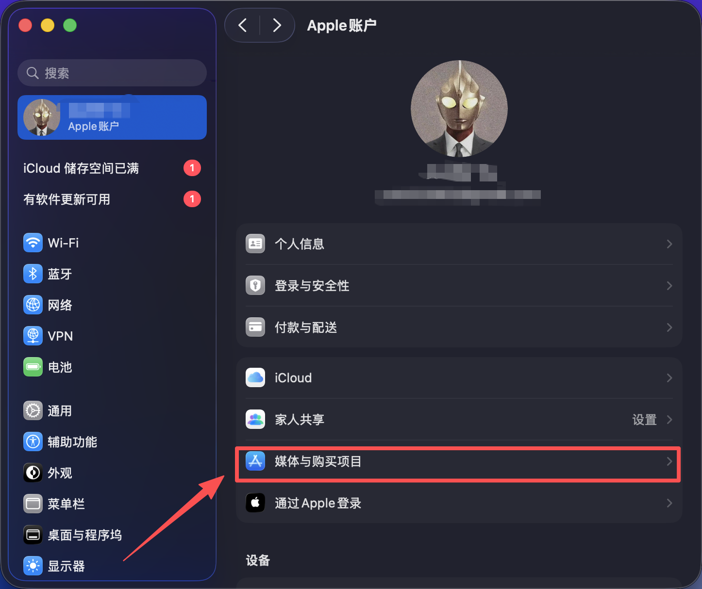

#### 3. 选择**退出登陆**。
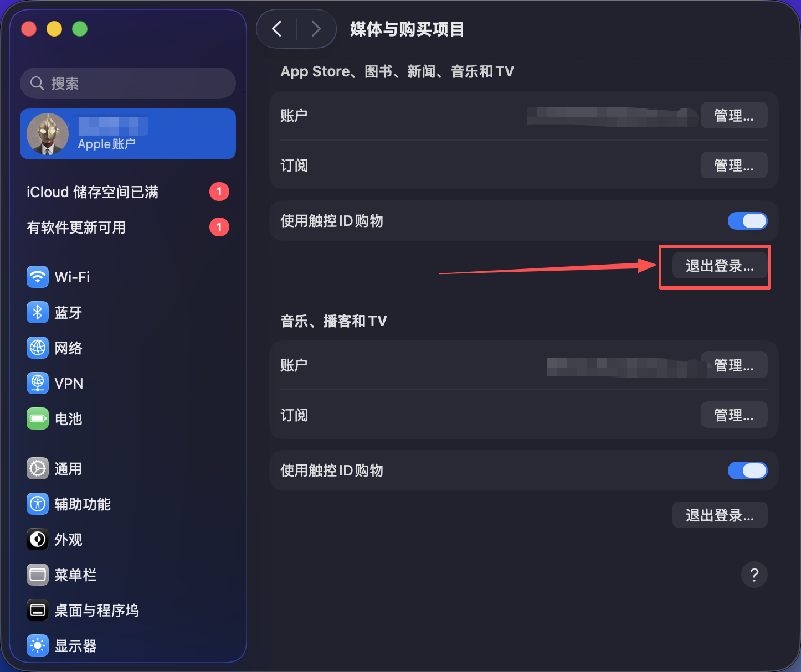

#### 4. 打开**App Store**，并点击左下角头像并输入您刚刚获取的 **外区 Apple ID 和密码**，点击登录。
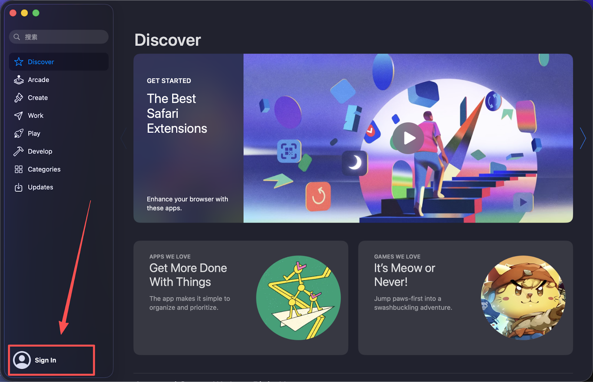
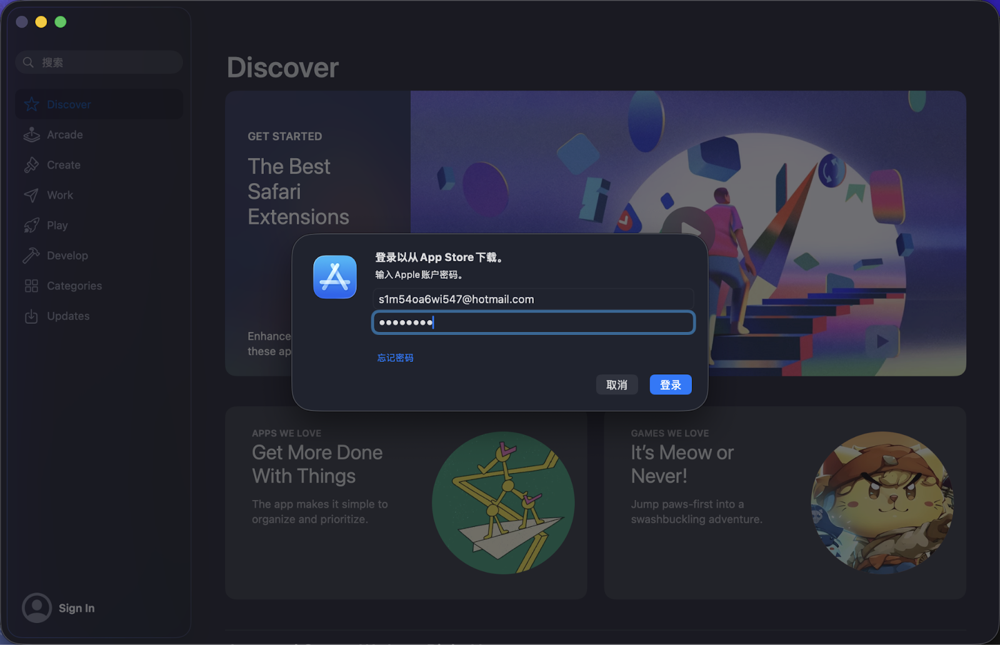

#### 5. **‼️关键步骤**：登录时若弹出安全验证，请务必选择 **「其他选项」** -> **「不升级」**。
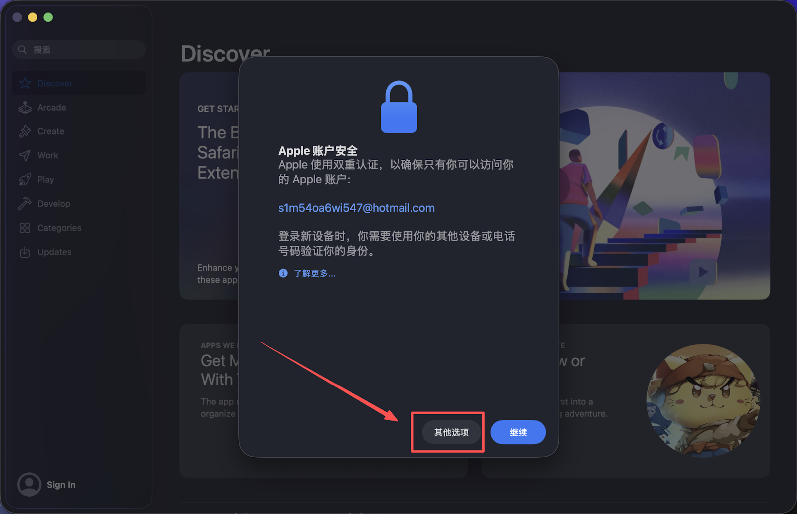
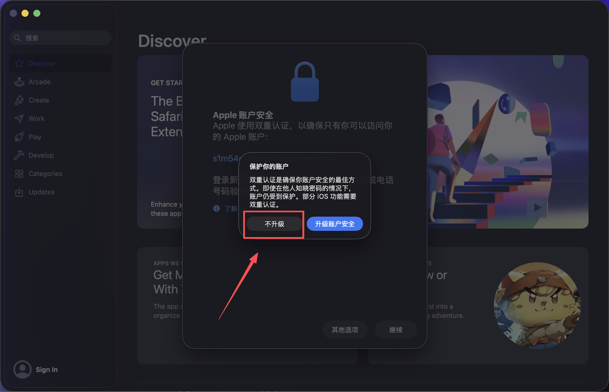
> ⚠️⚠️ **再次高风险预警：如果您采取的是方法一获取Apple ID，切勿在设置中登录！**
> * **绝对不要**在系统的「设置」或「iCloud」中登录此共享账号，否则可能导致设备被锁死！
> * **只能**在 **App Store** 软件内登录。

#### 6. 登录成功后，搜索 `Shadowrocket`。
- 请认准开发商为 **Shadow Launch Technology Limited**。
- 点击下载图标（如果是付费账号，显示为云下载图标是正常的，无需再次付费）。

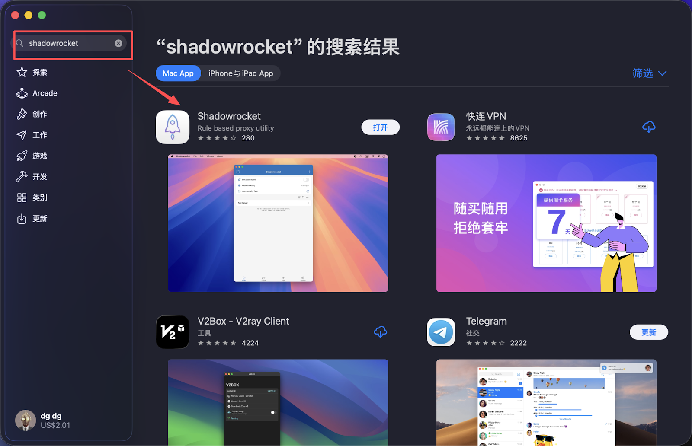
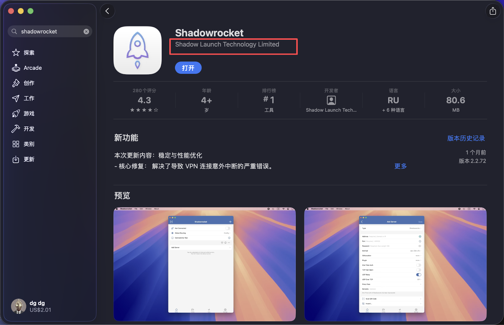

---
> **💡 建议操作：**
> 既然已经登录了海外 Apple ID，建议您顺便搜索并下载您需要的其他热门软件，例如：
> * **视频社交：** TikTok, YouTube, Instagram (Ins), Netflix
> * **实用工具：** Google Search, Google Maps, Gmail
> * **即时通讯：** WhatsApp, Telegram
> 这样可以省去以后频繁切换账号的麻烦。

#### 7. **‼️ 关键步骤**：下载完成后，请务必**立即退出**该临时账号，并换回您自己的 Apple ID。
---

## 🚀 配置教程
开始配置前，请确保：

- ✅ 已成功安装 Shadowrocket

### 🛠️ 导入配置

#### 🔗 方法一：订阅链接导入

##### 步骤 1：打开应用

启动 Shadowrocket，进入主界面：

##### 步骤 2：添加订阅

点击右上角的 `+` 号，选择 `Subscribe`：

##### 步骤 3：粘贴链接

在 URL 框中粘贴订阅链接，点击完成：

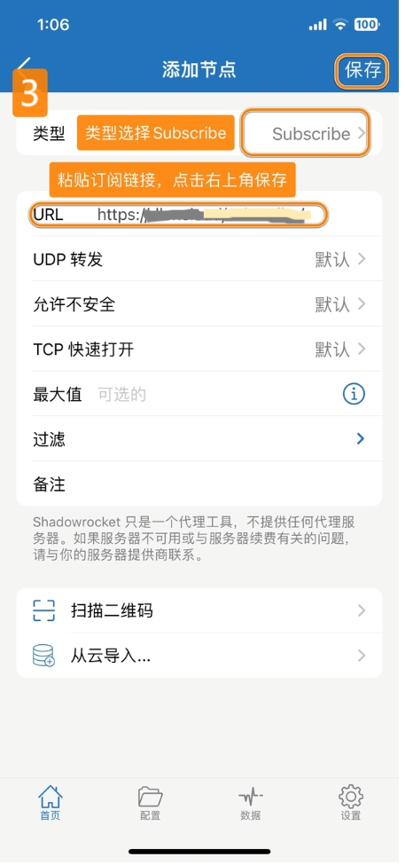

##### 步骤 4：更新订阅（很重要）
这一步很重要，建议每次导入后都手动更新一次，也建议定期更新订阅因为我们会定期更新节点服务器配置。如果出现连不上，速度慢等等优先更新订阅！

拖动订阅条目，点击 `Update` 更新节点：

#### 📱 方法二：二维码扫描

#### 1. 点击左上角的扫描图标
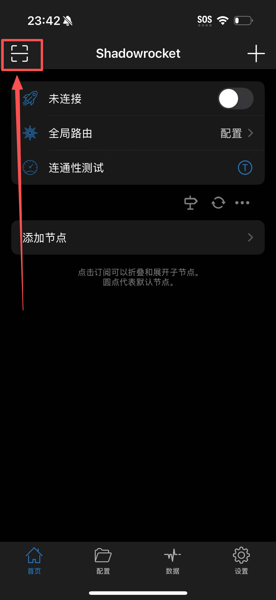
#### 2. 扫描您主页订阅的二维码
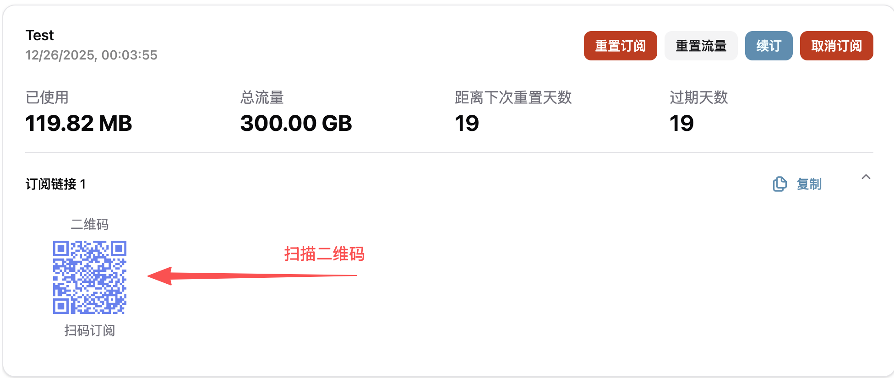
#### 3. 自动识别并导入配置

---

## 🌐 使用指南

### 🎯 连接服务器

1. 在主界面选一个节点
2. 打开顶部开关
3. 第一次连接时允许 VPN

## 成功标志

- 开关已经打开
- 状态栏出现 VPN 图标
- 浏览器可以正常打开目标网站

## 最容易踩坑的地方

- **共享 Apple ID 登录到了系统设置里**：这是最危险的错误，只能在 App Store 登录。
- **下载完没退出共享账号**
- **导入了订阅，但没更新**
- **没打开顶部开关**
- **第一次 VPN 授权点了拒绝**

## 还不行怎么办

按这个顺序排查：

1. 是否已经成功下载正版 Shadowrocket
2. 是否导入的是完整订阅链接
3. 是否更新过订阅
4. 是否换过其他节点
5. 是否已允许 VPN

如果还不行，请提交工单并附上截图。