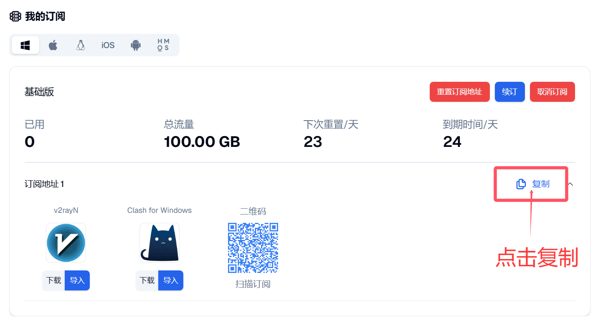
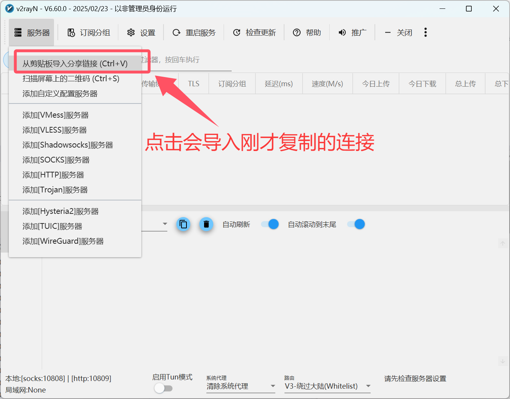
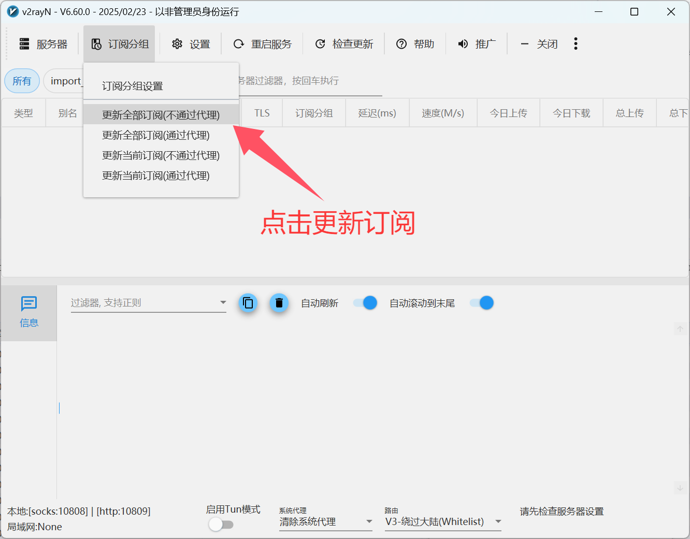

# 🚀 v2rayN for Windows

> ⚡ **Windows 平台首选代理客户端** | 多协议支持，功能全面，操作简便

[v2rayN](https://github.com/2dust/v2rayN) 是 Windows 系统上最受欢迎的图形化代理客户端，基于 .NET 框架开发，支持众多主流代理协议，为用户提供稳定高效的代理服务。

## 📊 协议支持

| 协议类型 | 支持状态 | 性能 | 推荐度 |
|---------|---------|------|--------|
| 🔗 **Shadowsocks (SS)** | ✅ 完全支持 | ⭐⭐⭐⭐ | ⭐⭐⭐⭐ |
| 🛡️ **ShadowsocksR (SSR)** | ✅ 完全支持 | ⭐⭐⭐⭐ | ⭐⭐⭐ |
| 🌐 **SOCKS5** | ✅ 完全支持 | ⭐⭐⭐⭐ | ⭐⭐⭐⭐ |
| ⚡ **Snell** | ✅ 完全支持 | ⭐⭐⭐⭐⭐ | ⭐⭐⭐⭐ |
| 🚀 **V2Ray (VMess)** | ✅ 完全支持 | ⭐⭐⭐⭐⭐ | ⭐⭐⭐⭐⭐ |
| 🛡️ **Trojan** | ✅ 完全支持 | ⭐⭐⭐⭐⭐ | ⭐⭐⭐⭐⭐ |
| 🔐 **VLESS** | ✅ 完全支持 | ⭐⭐⭐⭐⭐ | ⭐⭐⭐⭐ |
| 🌊 **Hysteria** | ✅ 完全支持 | ⭐⭐⭐⭐⭐ | ⭐⭐⭐⭐ |

## 🔧 系统要求

### 💻 运行环境

| 项目 | 最低要求 | 推荐配置 | 说明 |
|------|----------|----------|------|
| **操作系统** | Windows 10 (64-bit) | Windows 10/11 最新版 | 仅支持 64 位系统 |
| **处理器** | Intel/AMD 双核 | 四核及以上 | 支持主流 CPU 架构 |
| **内存** | 4GB RAM | 8GB+ RAM | 保证流畅运行 |
| **存储空间** | 100MB+ | 500MB+ | 含配置和日志文件 |
| **.NET 框架** | .NET 6.0+ | 最新版本 | 必需运行环境 |

## 📥 官方下载

> 💡 **下载建议**：推荐从官方 GitHub 或镜像源下载最新版本

### 🌟 下载源列表

| 下载源 | 类型 | 速度 | 稳定性 | 推荐度 |
|-------|------|------|--------|--------|
| [🚀 镜像加速 1](https://git.886.be/https://github.com/2dust/v2rayN/releases/download/6.60/v2rayN.zip) | 镜像源 | ⭐⭐⭐⭐⭐ | ⭐⭐⭐⭐⭐ | ⭐⭐⭐⭐⭐ |
| [⚡ 镜像加速 2](https://gh.xxooo.cf/https://github.com/2dust/v2rayN/releases/download/6.60/v2rayN.zip) | 镜像源 | ⭐⭐⭐⭐ | ⭐⭐⭐⭐ | ⭐⭐⭐⭐ |
| [📦 官方 GitHub](https://github.com/2dust/v2rayN/releases/download/6.60/v2rayN.zip) | 官方源 | ⭐⭐⭐ | ⭐⭐⭐⭐⭐ | ⭐⭐⭐⭐⭐ |

### 📋 版本信息
- **当前版本**：v6.60
- **发布日期**：2024年11月
- **文件大小**：约 15MB
- **文件格式**：ZIP 压缩包

## 🚀 完整使用教程

### 🎯 步骤一：启动应用程序

下载并解压 v2rayN 到任意目录后，双击 `v2rayN.exe` 启动程序。

> **初次启动提示**：程序会自动检查运行环境，如提示缺少组件请按提示安装

### 📋 步骤二：获取订阅链接

> **订阅链接获取**：从您的服务提供商处获取订阅链接并复制

### 📥 步骤三：导入订阅配置

> **导入方式**：在订阅设置中粘贴订阅链接，支持多个订阅同时管理

### 🔄 步骤四：更新订阅节点

> **自动更新**：定期更新订阅以获取最新节点信息和配置

### ▶️ 步骤五：启用系统代理

> **代理模式**：可选择系统代理、PAC 模式或手动配置

### 🎛️ 步骤六：选择服务器节点

> **节点选择**：根据速度和延迟选择最适合的服务器节点

### ⏹️ 步骤七：停止代理服务

> **安全退出**：使用完毕后记得关闭代理，恢复正常网络设置

## ✨ 核心功能

### 🎯 订阅管理
- **多订阅支持**：同时管理多个订阅源
- **自动更新**：支持定时自动更新订阅
- **订阅分组**：按服务商或地区分组管理
- **订阅备份**：支持订阅配置的导入导出

### 🌐 代理模式
- **系统代理**：全局代理，所有流量通过代理
- **PAC 模式**：智能分流，自动判断是否需要代理
- **直连模式**：关闭代理，直接访问网络
- **手动配置**：自定义代理规则和端口

### 📊 状态监控
- **实时速度**：显示当前连接速度和流量统计
- **延迟测试**：一键测试所有节点延迟
- **连接状态**：实时显示连接状态和错误信息
- **流量统计**：记录上传下载流量使用情况

### ⚙️ 高级设置
- **路由规则**：自定义域名和 IP 分流规则
- **负载均衡**：支持多节点负载均衡
- **协议配置**：详细的协议参数配置
- **日志记录**：完整的连接和错误日志

## ❓ 常见问题

### 🔧 安装配置

**Q: 启动时提示缺少 .NET 框架怎么办？**

A: 解决步骤：

1. 访问 Microsoft 官网下载 .NET 6.0 或更高版本
2. 安装完成后重启计算机
3. 重新启动 v2rayN 程序
4. 如仍有问题，尝试以管理员身份运行

**Q: 程序无法启动或崩溃？**

A: 排查方法：

1. 检查系统是否为 64 位版本
2. 确认 .NET 框架版本是否正确
3. 临时关闭杀毒软件再尝试
4. 检查程序目录是否有写入权限

### 🌐 使用问题

**Q: 订阅更新失败怎么办？**

A: 解决方案：

1. 检查网络连接是否正常
2. 验证订阅链接是否有效
3. 尝试手动复制订阅链接重新添加
4. 检查是否被防火墙拦截

**Q: 连接成功但无法上网？**

A: 检查项目：

1. 确认已开启系统代理
2. 检查浏览器代理设置
3. 尝试切换不同的服务器节点
4. 查看程序日志寻找错误信息

**Q: 速度很慢怎么优化？**

A: 优化建议：

1. 选择延迟较低的服务器节点
2. 尝试不同的协议类型（如 VMess、Trojan）
3. 调整连接数和超时设置
4. 使用测速功能选择最快节点

## 🎨 界面特色

### 🖥️ 主界面
- **现代设计**：简洁直观的 Windows 原生界面
- **深色模式**：支持浅色和深色主题切换
- **多语言**：支持中英文等多种语言界面
- **快捷操作**：右键菜单提供快速操作选项

### 📊 监控面板
- **实时图表**：流量使用的图形化显示
- **节点状态**：直观显示节点在线状态和延迟
- **连接信息**：详细的连接参数和状态信息
- **系统托盘**：最小化到系统托盘，不占用任务栏

## 🛡️ 安全特性

### 🔐 数据安全
- **加密传输**：所有代理协议均支持强加密
- **本地存储**：配置信息安全存储在本地
- **隐私保护**：不记录用户访问内容
- **安全更新**：定期更新修复安全漏洞

### 🛠️ 稳定性
- **自动重连**：网络中断时自动重新连接
- **故障转移**：节点失效时自动切换备用节点
- **内存优化**：高效的内存使用，长时间运行稳定
- **错误处理**：完善的错误处理和恢复机制

## 🔄 更新维护

### 📅 版本历史
- **v6.60 (2024.11)**：优化性能，新增协议支持
- **v6.50 (2024.09)**：界面改进，修复已知问题
- **v6.40 (2024.07)**：增强稳定性，添加新功能
- **定期更新**：开发团队保持活跃维护

### 🔄 自动更新
- **更新检查**：启动时自动检查新版本
- **一键更新**：支持应用内直接更新
- **版本回退**：支持回退到之前的稳定版本
- **更新通知**：及时提醒用户重要更新

## 📞 技术支持

- 🌐 **项目主页**：[GitHub 仓库](https://github.com/2dust/v2rayN)
- 📋 **问题反馈**：[Issues 页面](https://github.com/2dust/v2rayN/issues)
- 📚 **使用文档**：[Wiki 文档](https://github.com/2dust/v2rayN/wiki)
- 💬 **社区交流**：Telegram 群组和 QQ 群

---

> 📅 最后更新：2025年7月10日 | ⚡ 适用版本：v2rayN 6.60
