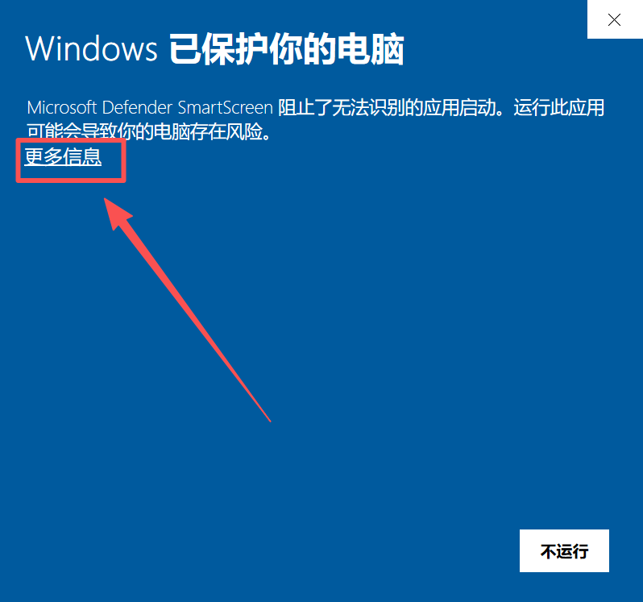
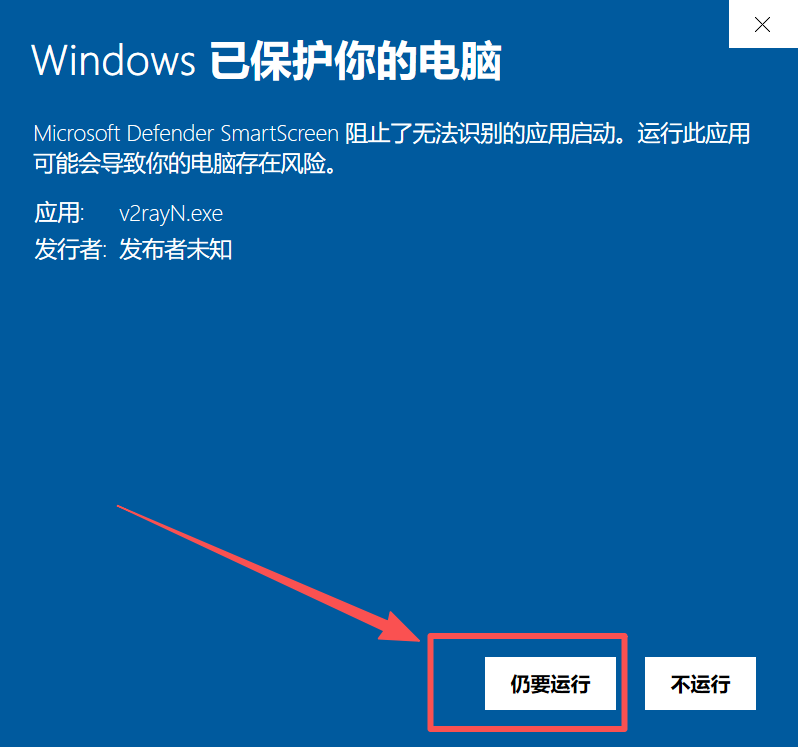

# 🚀 v2rayN - Windows 推荐客户端

> ⚡ **Windows 平台首选代理客户端** | 多协议支持，功能全面，操作简便

**v2rayN** 是 Windows 系统上最受欢迎的图形化代理客户端，基于 .NET 框架开发，支持众多主流代理协议，为用户提供稳定高效的代理服务。

### 💻 运行环境

| 项目 | 最低要求 | 推荐配置 | 说明 |
|------|----------|----------|------|
| **操作系统** | Windows 10 (64-bit) | Windows 10/11 最新版 | 仅支持 64 位系统 |
| **处理器** | Intel/AMD 双核 | 四核及以上 | 支持主流 CPU 架构 |
| **内存** | 4GB RAM | 8GB+ RAM | 保证流畅运行 |
| **存储空间** | 100MB+ | 500MB+ | 含配置和日志文件 |
| **.NET 框架** | .NET 6.0+ | 最新版本 | 必需运行环境 |

## 📥 官方安全免费下载

我们为您提供了高速免费下载通道，文件托管于云端存储，安全无毒。

| 版本 | 文件名 | 下载链接 |
| :--- | :--- | :--- |
| **最新版** | `v2rayN.zip` | [**⬇️ 点击直接下载**](https://download.onsucloud.com/v2rayN.zip) |

> ⚠️ **自主下载重要提示**
> 
> 如果您选择自行寻找安装包，请务必认准 **官方发布渠道** (如 GitHub)，切勿下载来路不明的修改版，以免电脑中毒。
> 
> **特别注意**：请务必下载 **最新版本**！由于我们需要支持 Xray/Reality 新协议，**部分老版本客户端将无法连接**。

---

## 🚀 完整使用教程

### 🎯 步骤一：启动应用程序

下载并解压 v2rayN 到任意目录后，双击 `v2rayN.exe` 启动程序。

> **初次启动提示**：程序会自动检查运行环境，如提示缺少组件请按提示安装。若弹出提示窗口，选择**更多信息**，选择**仍要运行**

### 📋 步骤二：获取订阅链接

> **订阅链接获取**：从用户中心**复制订阅链接**

### 📥 步骤三：导入订阅配置

> **导入方式**：在订阅设置中粘贴订阅链接，支持多个订阅同时管理

### 🔄 步骤四：更新订阅节点

> **自动更新**：定期更新订阅以获取最新节点信息和配置

### ▶️ 步骤五：启用系统代理

> **代理模式**：可选择系统代理、PAC 模式或手动配置

### 🎛️ 步骤六：选择服务器节点

> **节点选择**：根据速度和延迟选择最适合的服务器节点

### ⏹️ 步骤七：停止代理服务

> **安全退出**：使用完毕后记得关闭代理，恢复正常网络设置

---

## ❓ 常见问题

### 🔧 安装配置

**Q: 启动时提示缺少 .NET 框架怎么办？**

A: 解决步骤：

1. 访问 Microsoft 官网下载 .NET 6.0 或更高版本
2. 安装完成后重启计算机
3. 重新启动 v2rayN 程序
4. 如仍有问题，尝试以管理员身份运行

**Q: 程序无法启动或崩溃？**

A: 排查方法：

1. 检查系统是否为 64 位版本
2. 确认 .NET 框架版本是否正确
3. 临时关闭杀毒软件再尝试
4. 检查程序目录是否有写入权限

### 🌐 使用问题

**Q: 订阅更新失败怎么办？**

A: 解决方案：

1. 检查网络连接是否正常
2. 验证订阅链接是否有效
3. 尝试手动复制订阅链接重新添加
4. 检查是否被防火墙拦截

**Q: 连接成功但无法上网？**

A: 检查项目：

1. 确认已开启系统代理
2. 检查浏览器代理设置
3. 尝试切换不同的服务器节点
4. 查看程序日志寻找错误信息

**Q: 速度很慢怎么优化？**

A: 优化建议：

1. 选择延迟较低的服务器节点
2. 尝试不同的协议类型（如 VMess、Trojan）
3. 调整连接数和超时设置
4. 使用测速功能选择最快节点

---
## 🎫 需要更多帮助？

如果您在使用过程中遇到任何问题，或者上述 FAQ 无法解决您的情况，请随时联系我们：

请登录网站后台，点击 **「用户支持」** → **「工单管理」** 向我们提交工单。

> 💡 **我们随时为您服务**
> 
> 收到您的工单后，我们的技术支持团队会尽快为您排查并处理。为了提高解决效率，建议您在工单中附上**报错截图**或**详细描述**。