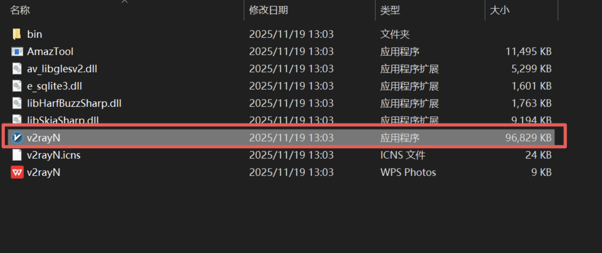
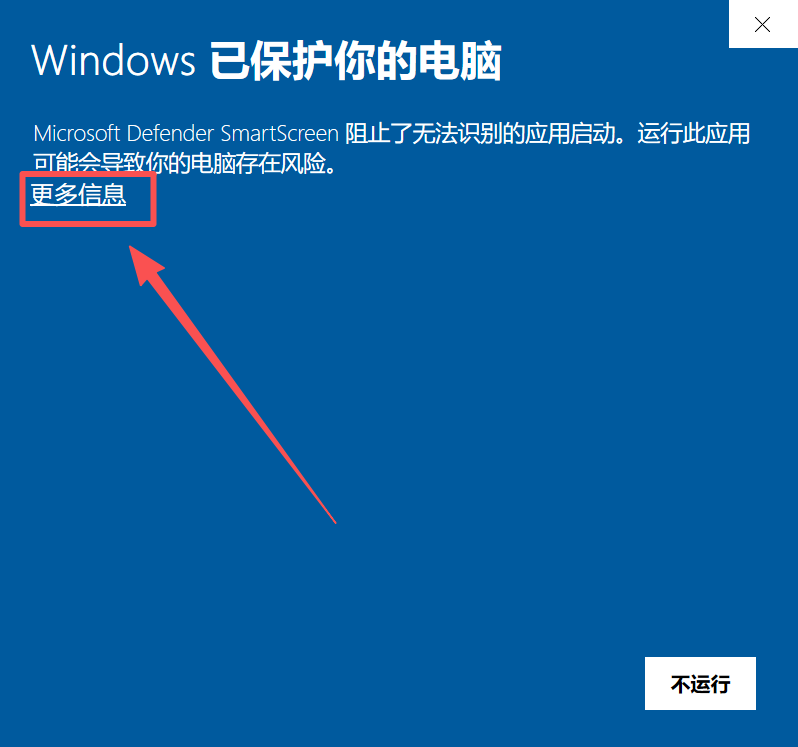
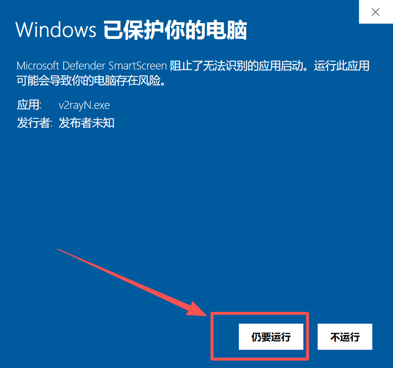
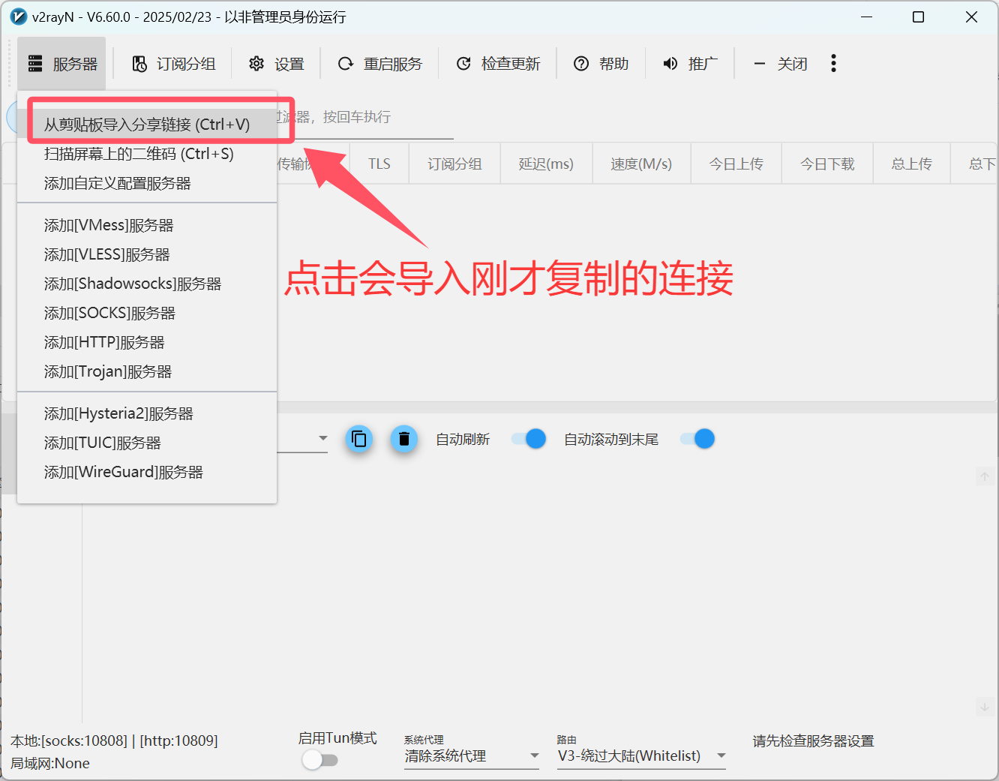
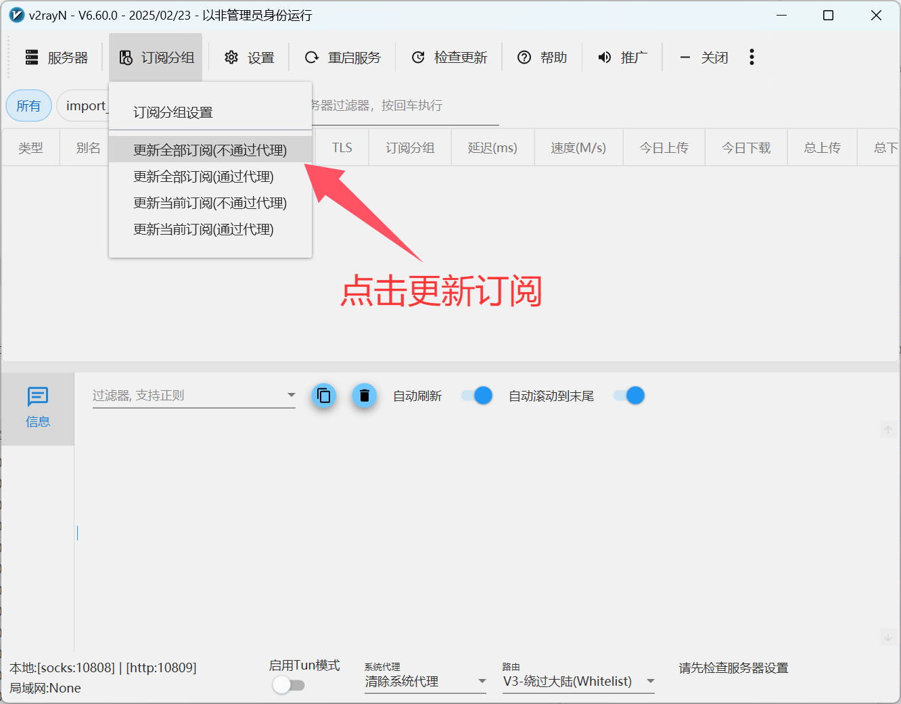
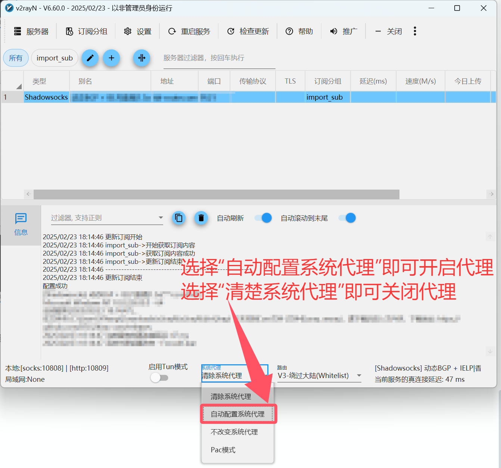
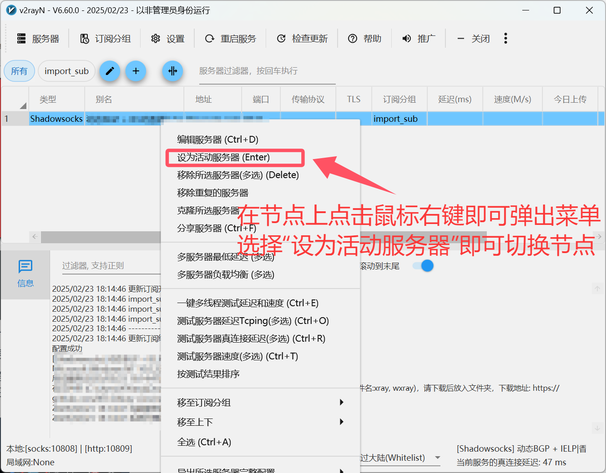
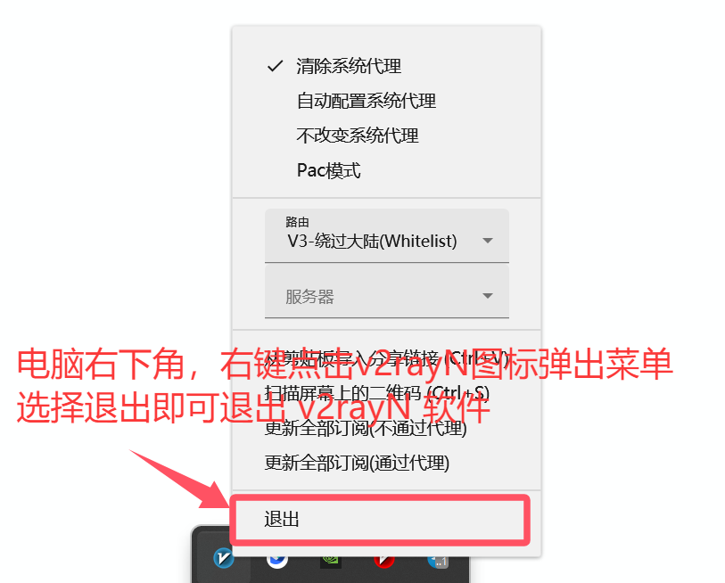

# v2rayN（Windows）

这篇只讲怎么尽快配置成功。

## 第 0 步：下载安装

| 版本 | 文件名 | 下载链接 |
| :--- | :--- | :--- |
| 最新版 | `v2rayN.zip` | [⬇️ 点击直接下载](https://download.onsucloud.com/v2rayN.zip) |

先下载并解压，然后双击 `v2rayN.exe` 打开。

如果 Windows 弹出安全提示，按下面做：

1. 点击 **“更多信息”**
2. 再点 **“仍要运行”**

## 第 1 步：复制订阅链接

到用户中心复制订阅链接。

注意：

- 复制的是 **订阅链接**
- 不要多复制空格、文字或说明

## 第 2 步：导入订阅

打开 v2rayN，点击导入刚才复制的链接。

看到节点列表后，说明导入成功。

## 第 3 步：更新订阅（很重要）

这一步很重要，建议每次导入后都手动更新一次，也建议定期更新订阅因为我们会定期更新节点服务器配置。如果出现连不上，速度慢等等优先更新订阅！

这一步很重要：

- 不更新，可能节点不全
- 不更新，旧节点可能连不上

## 第 4 步：开启代理

开启系统代理。

如果你只导入了订阅，但没开系统代理，浏览器通常还是不能正常走代理。

## 第 5 步：选择节点并连接

选一个节点使用。

## 用完怎么关闭

用完后把系统代理清掉。

## 成功标志

- 节点列表能正常显示
- 更新订阅没有报错
- 已开启系统代理
- 浏览器可以正常打开目标网站

## 最容易踩坑的地方

- **没有解压就直接运行**：请先解压再打开。
- **没装运行环境**：如果提示缺少 .NET，请按提示安装后再打开。
- **导入成功但不能上网**：通常是没开系统代理，或者节点本身不可用。
- **订阅更新失败**：先检查本机网络，再检查订阅链接是否复制完整。
- **软件能开但没有节点**：通常是导入错了内容，重新从用户中心复制一次。
- **只支持win10及以上！不支持win7或者更老版本！**

## 还不行怎么办

请登录网站后台，点击 **「用户支持」** → **「工单管理」** 提交工单。

建议附上：

- 报错截图
- 当前选中的节点
- 你卡在哪一步
